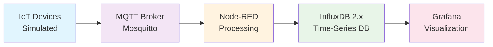

# 🌱 IoT Renewable Energy Monitoring System

> **A comprehensive IoT-based real-time monitoring system for renewable energy sources** including photovoltaic panels, wind turbines, biogas plants, heat boilers, and energy storage systems. Built with Node-RED, MQTT, InfluxDB 2.x, and Grafana using Docker containerization.

[](https://www.docker.com/)
[](https://mosquitto.org/)
[](https://www.influxdata.com/)
[](https://grafana.com/)
[](https://nodered.org/)

---

## 📋 Table of Contents

- [🏗️ System Architecture](#-system-architecture)
- [🚀 Quick Start Guide](#-quick-start-guide)
- [🧪 Testing Framework](#-testing-framework)
- [🔧 Configuration](#-configuration)
- [🛡️ Security](#-security)
- [🔄 Development](#-development)
- [📚 Documentation](#-documentation)
- [🤝 Contributing](#-contributing)
- [🆘 Support](#-support)

---

## 🏗️ System Architecture

The system follows a **pipeline architecture** where data flows through multiple processing stages:

### 🔄 Data Flow Pipeline

```
┌─────────────────┐    ┌─────────────────┐    ┌─────────────────┐    ┌─────────────────┐
│   IoT Devices   │───▶│   MQTT Broker   │───▶│   Node-RED      │───▶│   InfluxDB 2.x  │
│   (Simulated)   │    │   (Mosquitto)   │    │   (Processing)  │    │   (Database)    │
│                 │    │                 │    │                 │    │                 │
│ • Photovoltaic  │    │ • Topic Routing │    │ • Data Validation│    │ • Time-series   │
│ • Wind Turbine  │    │ • Authentication│    │ • Transformation│    │ • Measurements  │
│ • Biogas Plant  │    │ • QoS Management│    │ • Aggregation   │    │ • Retention     │
│ • Heat Boiler   │    │ • Message Retain│    │ • Error Handling│    │ • Flux Queries  │
│ • Energy Storage│    │                 │    │ • Device Sim.   │    │                 │
└─────────────────┘    └─────────────────┘    └─────────────────┘    └─────────────────┘
                                                                              │
                                                                              ▼
                                                                   ┌─────────────────┐
                                                                   │   Grafana       │
                                                                   │ (Visualization) │
                                                                   │                 │
                                                                   │ • 7 Dashboards  │
                                                                   │ • Alerts        │
                                                                   │ • Analytics     │
                                                                   │ • Reports       │
                                                                   └─────────────────┘
```

> **💡 Note**: IoT devices are currently **simulated within Node-RED** using realistic mathematical models. The system is designed to easily integrate with real IoT devices by replacing simulation nodes with actual device connections.

### 🏭 FUXA SCADA Integration (Under Construction)

**FUXA** is a web-based Process Visualization (SCADA/HMI/Dashboard) software that will provide industrial-style Human Machine Interface (HMI) capabilities to our renewable energy monitoring system. 

- **🔗 Official Repository**: [FUXA by frangoteam](https://github.com/frangoteam/FUXA)
- **🎯 Purpose**: Additional visualization layer alongside Grafana and the custom React web app
- **🔧 Features**: Real-time monitoring, control interfaces, alarm management, and asset-specific dashboards
- **📊 Integration**: Will connect via MQTT to provide operator control interfaces and real-time asset management
- **🚧 Status**: Currently under development and integration planning

> **📋 Note**: FUXA SCADA integration is planned as an additional visualization layer to complement the existing Grafana dashboards and custom React web application, providing industrial HMI capabilities for renewable energy asset management.



---

## 🚀 Quick Start Guide

### **Prerequisites**

- **Docker & Docker Compose**: Latest version installed
- **Git**: For version control
- **SSH Access**: To your VPS (for production deployment)

### **Local Development (Windows)**

The local development environment uses **Nginx reverse proxy** on port **8080** to route requests to all services:

```powershell
# Clone the repository
git clone https://github.com/Viktar-T/plat-edu-bad-data-mvp.git
cd plat-edu-bad-data-mvp

# Start local development environment
.\scripts\dev-local.ps1

# Access all services through Nginx reverse proxy at http://localhost:8080:
# - React Frontend: http://localhost:8080/app/
# - Express API: http://localhost:8080/api/
#   - Health: http://localhost:8080/api/health
#   - Summary: http://localhost:8080/api/summary/{device}
# - Grafana: http://localhost:8080/grafana/ (admin/admin)
# - Node-RED: http://localhost:8080/nodered/ (admin/adminpassword)
# - InfluxDB Admin: http://localhost:8080/influxdb/ (admin/admin_password_123)
# - MQTT: localhost:1883 (admin/admin_password_456) - Direct connection only
```

> **💡 Note**: All web services are accessible through the Nginx reverse proxy on port 8080. MQTT broker (port 1883) requires direct connection as it uses the MQTT protocol, not HTTP.

### **Production Deployment**

Production deployments use direct port access for each service. Services are exposed on individual ports for direct access.

#### **Mikrus VPS (robert108.mikrus.xyz)**

```bash
# SSH to your VPS
ssh viktar@robert108.mikrus.xyz -p10108

# Clone the repository
git clone https://github.com/Viktar-T/plat-edu-bad-data-mvp.git
cd plat-edu-bad-data-mvp

# Set up environment
cp .env.production .env

# Fix permissions (IMPORTANT for VPS deployment)
sudo chown -R 472:472 ./grafana/data ./grafana/plugins
sudo chown -R 1000:1000 ./node-red/data
sudo chown -R 1883:1883 ./mosquitto/data ./mosquitto/log
sudo chown -R 472:472 ./influxdb/data
sudo chmod -R 755 ./grafana/data ./grafana/plugins ./node-red/data ./mosquitto/data ./mosquitto/log ./influxdb/data

# Start services
sudo docker-compose up -d

# Access your services:
# - Frontend Dashboard: http://robert108.mikrus.xyz:40103
# - API Endpoints: http://robert108.mikrus.xyz:40102
#   - Health: http://robert108.mikrus.xyz:40102/health
#   - Summary: http://robert108.mikrus.xyz:40102/api/summary/{device}
# - Grafana: http://robert108.mikrus.xyz:40099 (admin/admin)
# - Node-RED: http://robert108.mikrus.xyz:40100 (admin/adminpassword)
# - InfluxDB: http://robert108.mikrus.xyz:40101 (admin/admin_password_123)
# - MQTT: robert108.mikrus.xyz:40098 (admin/admin_password_456)
```

#### **edubad.zut.edu.pl**

**Server Information:**
- **Server**: [edubad.zut.edu.pl](http://edubad.zut.edu.pl/) (82.145.64.204)
- **Login**: `admin`
- **Password**: `XXXXXX`
- **Privileges**: Administrator access through `sudo`

```bash
# SSH to your server
ssh admin@edubad.zut.edu.pl
# or using IP address
ssh admin@82.145.64.204

# Clone the repository
git clone https://github.com/Viktar-T/plat-edu-bad-data-mvp.git
cd plat-edu-bad-data-mvp

# Set up environment
cp .env.production .env

# Fix permissions (IMPORTANT for deployment)
# Note: Administrator privileges required (use sudo)
sudo chown -R 472:472 ./grafana/data ./grafana/plugins
sudo chown -R 1000:1000 ./node-red/data
sudo chown -R 1883:1883 ./mosquitto/data ./mosquitto/log
sudo chown -R 472:472 ./influxdb/data
sudo chmod -R 755 ./grafana/data ./grafana/plugins ./node-red/data ./mosquitto/data ./mosquitto/log ./influxdb/data

# Start services
sudo docker-compose up -d

# Access your services (replace [PORT] with actual configured ports):
# - Frontend Dashboard: http://edubad.zut.edu.pl:[FRONTEND_PORT]
# - API Endpoints: http://edubad.zut.edu.pl:[API_PORT]
#   - Health: http://edubad.zut.edu.pl:[API_PORT]/health
#   - Summary: http://edubad.zut.edu.pl:[API_PORT]/api/summary/{device}
# - Grafana: http://edubad.zut.edu.pl:[GRAFANA_PORT] (admin/admin)
# - Node-RED: http://edubad.zut.edu.pl:[NODE_RED_PORT] (admin/adminpassword)
# - InfluxDB: http://edubad.zut.edu.pl:[INFLUXDB_PORT] (admin/admin_password_123)
# - MQTT: edubad.zut.edu.pl:[MQTT_PORT] (admin/admin_password_456)
```

> **💡 Note**: Replace port placeholders with your actual configured ports for edubad.zut.edu.pl deployment. The `admin` user has administrator privileges through `sudo`.

### **Quick Production Deployment**

```powershell
# Build production images
.\scripts\deploy-production-apps.ps1 -Build

# Deploy to production
.\scripts\deploy-production-apps.ps1 -Deploy

# Check status
.\scripts\deploy-production-apps.ps1 -Status

# View logs
.\scripts\deploy-production-apps.ps1 -Logs
```

---

## 🧪 Testing Framework

### **Manual Testing**

The project includes comprehensive manual testing procedures:

```bash
# Navigate to tests directory
cd tests/manual-tests/

# Run tests in order:
# 1. Prerequisites check
# 2. MQTT broker testing
# 3. Node-RED data processing
# 4. InfluxDB data storage
# 5. Grafana data visualization
# 6. End-to-end data flow
```

### **Test Coverage**

- ✅ **MQTT Communication**: Topic publishing/subscribing
- ✅ **Node-RED Flows**: Data processing and transformation
- ✅ **InfluxDB Integration**: Data storage and retrieval
- ✅ **Grafana Dashboards**: Data visualization
- ✅ **Device Simulation**: Realistic data generation
- ✅ **Error Handling**: System resilience testing

---

## 🔧 Configuration

### **Environment Variables**

The system uses environment variables for configuration. Copy `env.example` to create your environment files:

```bash
# For local development
cp env.example .env.local

# For production
cp env.example .env.production
```

### **Key Configuration Sections**

- **MQTT Broker**: Port, authentication, logging
- **InfluxDB 2.x**: Database, retention, authentication
- **Node-RED**: Authentication, InfluxDB integration
- **Grafana**: Authentication, InfluxDB data source
- **Development**: Simulation settings, debug modes
- **Production**: Security settings, performance tuning

### **Data Retention**

```bash
# Default retention policy: 30 days
INFLUXDB_RETENTION=30d

# Custom retention policies
CUSTOM_RETENTION_POLICIES=system_metrics:7d,alerts:90d,analytics:365d
```

---

## 🛡️ Security

### **Authentication**

All services implement authentication:

- **Grafana**: `admin/admin`
- **Node-RED**: `admin/adminpassword`
- **InfluxDB**: `admin/admin_password_123`
- **MQTT**: `admin/admin_password_456`

### **Network Security**

- **Firewall Configuration**: Only required ports open
- **SSH Security**: Custom port (10108), fail2ban protection
- **Docker Security**: Container isolation, resource limits

### **Data Security**

- **Encryption**: TLS/SSL ready configuration
- **Access Control**: Role-based permissions
- **Audit Logging**: Comprehensive activity logging

---

## 🔄 Development

### **Local Development**

```powershell
# Start development environment (rebuilds containers by default)
.\scripts\dev-local.ps1

# Available commands
.\scripts\dev-local.ps1 -Status    # Check service status
.\scripts\dev-local.ps1 -Logs      # View service logs
.\scripts\dev-local.ps1 -Stop      # Stop services

# Rebuild options (to see code changes)
.\scripts\dev-local.ps1                    # Default start: Rebuilds and starts all containers
.\scripts\dev-local.ps1 -Restart           # Restart: Stops, rebuilds, and starts all containers
.\scripts\dev-local.ps1 -NoRebuild         # Start without rebuild: Starts without rebuilding
.\scripts\dev-local.ps1 -Restart -NoRebuild # Restart without rebuild: Restarts without rebuilding
```

> **💡 Tip**: By default, the script rebuilds containers to ensure you see all code changes. Use `-NoRebuild` only when you want faster startup without code changes.

### **Production Updates**

```bash
# SSH to VPS
ssh viktar@robert108.mikrus.xyz -p10108

# Update services
cd ~/plat-edu-bad-data-mvp
git pull --ff-only
cp .env.production .env
sudo docker-compose up -d

# Check status
sudo docker-compose ps
```

### **Custom Development**

- **Node-RED Flows**: Edit flows in Node-RED editor
- **Grafana Dashboards**: Customize dashboards in Grafana
- **InfluxDB Queries**: Use Flux language for custom queries
- **MQTT Topics**: Extend topic structure for new devices

---

## 📚 Documentation

### **Comprehensive Documentation**

- **README-DUAL-SETUP.md**: Dual environment setup guide
- **docs/deployment-vps/**: VPS deployment documentation
- **docs/prompts/**: Development and testing guides
- **web-app-for-testing/**: Custom web app documentation

### **API Documentation**

- **InfluxDB API**: Time-series database queries
- **MQTT API**: Message broker communication
- **Grafana API**: Dashboard and user management
- **Node-RED API**: Flow management and execution

---

## 🤝 Contributing

### **Development Guidelines**

1. **Local Testing**: Always test changes locally first
2. **Documentation**: Update documentation for any changes
3. **Environment Files**: Maintain environment file consistency
4. **Git Workflow**: Use feature branches for development
5. **Testing**: Run manual tests before deployment

### **Code Standards**

- **Node-RED**: Follow Node-RED best practices
- **Grafana**: Use consistent dashboard design patterns
- **InfluxDB**: Follow Flux query optimization guidelines
- **Docker**: Maintain container best practices

---

## 🆘 Support

### **Troubleshooting**

```bash
# Check service status
sudo docker-compose ps

# View service logs
sudo docker-compose logs -f [service_name]

# Restart services
sudo docker-compose restart

# Check system resources
htop
df -h
free -h
```

### **Common Issues**

- **Permission Errors**: Fix Docker volume permissions
- **Port Conflicts**: Check for port availability
- **Memory Issues**: Monitor system resources
- **Network Issues**: Verify connectivity and firewall settings

### **Getting Help**

- **Documentation**: Check comprehensive docs in `docs/`
- **Logs**: Review service logs for error details
- **Health Checks**: Monitor service health status
- **Community**: Use GitHub issues for bug reports

---

## 🎯 Project Status

### **✅ Completed Features**

- **Core Infrastructure**: MQTT, Node-RED, InfluxDB, Grafana
- **Device Simulation**: 5 renewable energy device types
- **Data Pipeline**: Complete MQTT → Node-RED → InfluxDB → Grafana flow
- **Dashboards**: 7 specialized Grafana dashboards
- **Deployment**: Local and production deployment scripts
- **Documentation**: Comprehensive documentation suite
- **Testing**: Manual testing framework
- **Security**: Authentication and basic security measures

### **🔄 In Development**

- **Custom Web App**: React + Express application (basic structure)
- **FUXA SCADA**: Industrial HMI integration planning
- **Advanced Analytics**: Machine learning and predictive analytics
- **Mobile App**: Mobile monitoring application

### **📋 Planned Features**

- **SSL/HTTPS**: Secure communication implementation
- **Advanced Alerts**: Sophisticated alerting system
- **Backup Automation**: Automated backup and recovery
- **Performance Optimization**: Advanced performance tuning
- **API Development**: RESTful API for external integrations

---

**🚀 Ready to monitor your renewable energy infrastructure with this comprehensive IoT system!** 