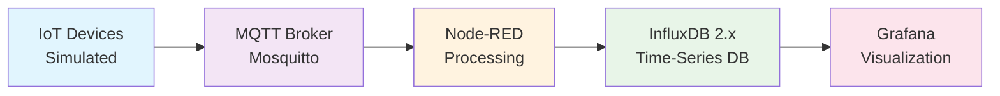

# 🌱 IoT Renewable Energy Monitoring System

> **A comprehensive IoT-based real-time monitoring system for renewable energy sources** including photovoltaic panels, wind turbines, biogas plants, heat boilers, and energy storage systems. Built with Node-RED, MQTT, InfluxDB 2.x, and Grafana using Docker containerization.

[](https://www.docker.com/)
[](https://mosquitto.org/)
[](https://www.influxdata.com/)
[](https://grafana.com/)
[](https://nodered.org/)

---

## 📋 Table of Contents

- [🏗️ System Architecture](#️-system-architecture)
- [🚀 Quick Start Guide](#-quick-start-guide)
- [📁 Project Structure](#-project-structure)
- [🔐 MQTT Configuration](#-mqtt-configuration)
- [🧪 Testing Framework](#-testing-framework)
- [🔧 Configuration](#-configuration)
- [📊 Data Flow](#-data-flow)
- [📈 Grafana Dashboards](#-grafana-dashboards)
- [🛡️ Security](#️-security)
- [📈 Monitoring](#-monitoring)
- [🔄 Development](#-development)
- [📚 Documentation](#-documentation)
- [🤝 Contributing](#-contributing)
- [🆘 Support](#-support)

---

## 🏗️ System Architecture

The system follows a **pipeline architecture** where data flows through multiple processing stages:

### 🔄 Data Flow Pipeline

```
┌─────────────────┐    ┌─────────────────┐    ┌─────────────────┐    ┌─────────────────┐
│   IoT Devices   │───▶│   MQTT Broker   │───▶│   Node-RED      │───▶│   InfluxDB 2.x  │
│   (Simulated)   │    │   (Mosquitto)   │    │   (Processing)  │    │   (Database)    │
│                 │    │                 │    │                 │    │                 │
│ • Photovoltaic  │    │ • Topic Routing │    │ • Data Validation│    │ • Time-series   │
│ • Wind Turbine  │    │ • Authentication│    │ • Transformation│    │ • Measurements  │
│ • Biogas Plant  │    │ • QoS Management│    │ • Aggregation   │    │ • Retention     │
│ • Heat Boiler   │    │ • Message Retain│    │ • Error Handling│    │ • Flux Queries  │
│ • Energy Storage│    │                 │    │ • Device Sim.   │    │                 │
└─────────────────┘    └─────────────────┘    └─────────────────┘    └─────────────────┘
                                                                              │
                                                                              ▼
                                                                   ┌─────────────────┐
                                                                   │   Grafana       │
                                                                   │ (Visualization) │
                                                                   │                 │
                                                                   │ • 7 Dashboards  │
                                                                   │ • Alerts        │
                                                                   │ • Analytics     │
                                                                   │ • Reports       │
                                                                   └─────────────────┘
```

> **💡 Note**: IoT devices are currently **simulated within Node-RED** using realistic mathematical models. The system is designed to easily integrate with real IoT devices by replacing simulation nodes with actual device connections.

### 🏭 FUXA SCADA Integration (Under Construction)

**FUXA** is a web-based Process Visualization (SCADA/HMI/Dashboard) software that will provide industrial-style Human Machine Interface (HMI) capabilities to our renewable energy monitoring system. 

- **🔗 Official Repository**: [FUXA by frangoteam](https://github.com/frangoteam/FUXA)
- **🎯 Purpose**: Additional visualization layer alongside Grafana and the custom React web app
- **🔧 Features**: Real-time monitoring, control interfaces, alarm management, and asset-specific dashboards
- **📊 Integration**: Will connect via MQTT to provide operator control interfaces and real-time asset management
- **🚧 Status**: Currently under development and integration planning

> **📋 Note**: FUXA SCADA integration is planned as an additional visualization layer to complement the existing Grafana dashboards and custom React web application, providing industrial HMI capabilities for renewable energy asset management.



---

## 🚀 Quick Start Guide

### **Prerequisites**

- **Docker & Docker Compose**: Latest version installed
- **Git**: For version control
- **SSH Access**: To your VPS (for production deployment)

### **Local Development (Windows)**

```powershell
# Clone the repository
git clone https://github.com/Viktar-T/plat-edu-bad-data-mvp.git
cd plat-edu-bad-data-mvp

# Start local development environment
.\scripts\dev-local.ps1

# Access your services:
# - Grafana: http://localhost:3000 (admin/admin)
# - Node-RED: http://localhost:1880 (admin/adminpassword)
# - InfluxDB: http://localhost:8086 (admin/admin_password_123)
# - MQTT: localhost:1883 (admin/admin_password_456)
```

### **Production Deployment (Mikrus VPS)**

```bash
# SSH to your VPS
ssh viktar@robert108.mikrus.xyz -p10108

# Clone the repository
git clone https://github.com/Viktar-T/plat-edu-bad-data-mvp.git
cd plat-edu-bad-data-mvp

# Set up environment
cp .env.production .env

# Fix permissions (IMPORTANT for VPS deployment)
sudo chown -R 472:472 ./grafana/data ./grafana/plugins
sudo chown -R 1000:1000 ./node-red/data
sudo chown -R 1883:1883 ./mosquitto/data ./mosquitto/log
sudo chown -R 472:472 ./influxdb/data
sudo chmod -R 755 ./grafana/data ./grafana/plugins ./node-red/data ./mosquitto/data ./mosquitto/log ./influxdb/data

# Start services
sudo docker-compose up -d

# Access your services:
# - Grafana: http://robert108.mikrus.xyz:40099 (admin/admin)
# - Node-RED: http://robert108.mikrus.xyz:40100 (admin/adminpassword)
# - InfluxDB: http://robert108.mikrus.xyz:40101 (admin/admin_password_123)
# - MQTT: robert108.mikrus.xyz:40098 (admin/admin_password_456)
```

---

## 📁 Project Structure

```
plat-edu-bad-data-mvp/
├── 📄 docker-compose.yml              # Production configuration
├── 📄 docker-compose.local.yml        # Local development
├── 📄 .env.local                      # Local environment variables
├── 📄 .env.production                 # Production environment variables
├── 📄 env.example                     # Environment template
├── 📁 scripts/
│   ├── 📄 dev-local.ps1               # Local development script
│   └── 📄 deploy-production.ps1       # Production deployment script
├── 📁 mosquitto/                      # MQTT broker configuration
│   ├── 📁 config/                     # Mosquitto configuration
│   ├── 📁 data/                       # MQTT data storage
│   └── 📁 log/                        # MQTT logs
├── 📁 influxdb/                       # InfluxDB configuration
│   ├── 📁 config/                     # InfluxDB configuration
│   ├── 📁 data/                       # Time-series data
│   └── 📁 backups/                    # Database backups
├── 📁 node-red/                       # Node-RED configuration
│   ├── 📁 data/                       # Node-RED data
│   └── 📁 flows/                      # IoT device simulation flows
│       ├── 📄 v2.0-pv-simulation.json
│       ├── 📄 v2.0-wind-turbine-simulation.json
│       ├── 📄 v2.0-biogas-plant-simulation.json
│       ├── 📄 v2.0-heat-boiler-simulation.json
│       └── 📄 v2.0-energy-storage-simulation.json
├── 📁 grafana/                        # Grafana configuration
│   ├── 📁 data/                       # Grafana data
│   ├── 📁 dashboards/                 # 7 specialized dashboards
│   │   ├── 📄 renewable-energy-overview.json
│   │   ├── 📄 photovoltaic-monitoring.json
│   │   ├── 📄 wind-turbine-analytics.json
│   │   ├── 📄 biogas-plant-metrics.json
│   │   ├── 📄 heat-boiler-monitoring.json
│   │   ├── 📄 energy-storage-monitoring.json
│   │   └── 📄 simple.json
│   └── 📁 provisioning/               # Auto-provisioning config
├── 📁 web-app-for-testing/            # Custom web application (Under Development)
│   ├── 📁 backend/                    # Express.js backend (Basic)
│   └── 📁 frontend/                   # React frontend (Basic)
├── 📁 docs/                           # Comprehensive documentation
│   └── 📁 deployment-vps/             # VPS deployment guides
└── 📁 tests/                          # Testing framework
```

---

## 🔐 MQTT Configuration

### **Topics Structure**

The system uses a hierarchical topic structure for organized data flow:

```
devices/
├── photovoltaic/
│   ├── pv_001/
│   │   ├── power_output
│   │   ├── efficiency
│   │   ├── temperature
│   │   └── status
│   └── pv_002/
├── wind_turbine/
│   ├── wt_001/
│   │   ├── power_output
│   │   ├── wind_speed
│   │   ├── rotor_speed
│   │   └── status
│   └── wt_002/
├── biogas_plant/
│   ├── bg_001/
│   │   ├── gas_flow_rate
│   │   ├── methane_concentration
│   │   ├── temperature
│   │   └── status
│   └── bg_002/
├── heat_boiler/
│   ├── hb_001/
│   │   ├── heat_output
│   │   ├── fuel_consumption
│   │   ├── efficiency
│   │   └── status
│   └── hb_002/
└── energy_storage/
    ├── es_001/
    │   ├── battery_level
    │   ├── charge_rate
    │   ├── discharge_rate
    │   └── status
    └── es_002/
```

### **Authentication**

MQTT broker is configured with authentication:

```bash
# Default credentials
MQTT_ADMIN_USER=admin
MQTT_ADMIN_PASSWORD=admin_password_456
```

---

## 🧪 Testing Framework

### **Manual Testing**

The project includes comprehensive manual testing procedures:

```bash
# Navigate to tests directory
cd tests/manual-tests/

# Run tests in order:
# 1. Prerequisites check
# 2. MQTT broker testing
# 3. Node-RED data processing
# 4. InfluxDB data storage
# 5. Grafana data visualization
# 6. End-to-end data flow
```

### **Test Coverage**

- ✅ **MQTT Communication**: Topic publishing/subscribing
- ✅ **Node-RED Flows**: Data processing and transformation
- ✅ **InfluxDB Integration**: Data storage and retrieval
- ✅ **Grafana Dashboards**: Data visualization
- ✅ **Device Simulation**: Realistic data generation
- ✅ **Error Handling**: System resilience testing

---

## 🔧 Configuration

### **Environment Variables**

The system uses environment variables for configuration. Copy `env.example` to create your environment files:

```bash
# For local development
cp env.example .env.local

# For production
cp env.example .env.production
```

### **Key Configuration Sections**

- **MQTT Broker**: Port, authentication, logging
- **InfluxDB 2.x**: Database, retention, authentication
- **Node-RED**: Authentication, InfluxDB integration
- **Grafana**: Authentication, InfluxDB data source
- **Development**: Simulation settings, debug modes
- **Production**: Security settings, performance tuning

### **Data Retention**

```bash
# Default retention policy: 30 days
INFLUXDB_RETENTION=30d

# Custom retention policies
CUSTOM_RETENTION_POLICIES=system_metrics:7d,alerts:90d,analytics:365d
```

---

## 📊 Data Flow

### **1. Data Generation (Node-RED Simulation)**

Node-RED generates realistic renewable energy data using mathematical models:

- **Photovoltaic**: Solar irradiance, temperature, efficiency calculations
- **Wind Turbine**: Wind speed, power curve, rotor dynamics
- **Biogas Plant**: Gas flow rates, methane concentration, temperature
- **Heat Boiler**: Fuel consumption, heat output, efficiency
- **Energy Storage**: Battery state of charge, charge/discharge cycles

### **2. MQTT Publishing**

Simulated data is published to MQTT topics:

```javascript
// Example: Photovoltaic data
{
  "timestamp": "2024-01-15T10:30:00Z",
  "device_id": "pv_001",
  "power_output": 2450.5,
  "efficiency": 0.187,
  "temperature": 45.2,
  "irradiance": 850.0,
  "status": "operational"
}
```

### **3. Data Processing (Node-RED)**

Node-RED flows process and validate incoming data:

- **Data Validation**: Range checks, format validation
- **Data Transformation**: Unit conversions, calculations
- **Error Handling**: Invalid data filtering, retry logic
- **Aggregation**: Time-based data summarization

### **4. InfluxDB Storage**

Processed data is stored in InfluxDB time-series database:

```sql
-- Example Flux query
from(bucket: "renewable_energy")
  |> range(start: -1h)
  |> filter(fn: (r) => r["_measurement"] == "photovoltaic_data")
  |> filter(fn: (r) => r["device_id"] == "pv_001")
```

### **5. Grafana Visualization**

Grafana dashboards visualize the data:

- **Real-time Monitoring**: Live data updates
- **Historical Analysis**: Trend analysis, comparisons
- **Alerts**: Threshold-based notifications
- **Reports**: Automated reporting

---

## 📈 Grafana Dashboards

### **Available Dashboards**

1. **Renewable Energy Overview** - System-wide monitoring
2. **Photovoltaic Monitoring** - Solar panel performance
3. **Wind Turbine Analytics** - Wind energy analysis
4. **Biogas Plant Metrics** - Biogas production monitoring
5. **Heat Boiler Monitoring** - Thermal energy tracking
6. **Energy Storage Monitoring** - Battery system management
7. **Simple Dashboard** - Basic metrics overview

### **Dashboard Features**

- **Real-time Updates**: Live data refresh
- **Interactive Panels**: Zoom, drill-down capabilities
- **Alert Integration**: Threshold-based alerts
- **Export Options**: PDF, CSV export
- **Responsive Design**: Mobile-friendly layouts

### **Data Sources**

All dashboards connect to InfluxDB 2.x:

```yaml
# Grafana data source configuration
url: http://influxdb:8086
org: renewable_energy_org
bucket: renewable_energy
token: renewable_energy_admin_token_123
```

---

## 🛡️ Security

### **Authentication**

All services implement authentication:

- **Grafana**: `admin/admin`
- **Node-RED**: `admin/adminpassword`
- **InfluxDB**: `admin/admin_password_123`
- **MQTT**: `admin/admin_password_456`

### **Network Security**

- **Firewall Configuration**: Only required ports open
- **SSH Security**: Custom port (10108), fail2ban protection
- **Docker Security**: Container isolation, resource limits

### **Data Security**

- **Encryption**: TLS/SSL ready configuration
- **Access Control**: Role-based permissions
- **Audit Logging**: Comprehensive activity logging

---

## 📈 Monitoring

### **Health Checks**

All services include Docker health checks:

```yaml
healthcheck:
  test: ["CMD-SHELL", "curl -f http://localhost:3000/api/health || exit 1"]
  interval: 30s
  timeout: 10s
  retries: 3
  start_period: 60s
```

### **Logging**

Comprehensive logging for all services:

```bash
# View service logs
sudo docker-compose logs -f [service_name]

# Log locations
./mosquitto/log/             # MQTT logs
./influxdb/logs/             # InfluxDB logs
./node-red/logs/             # Node-RED logs
./grafana/logs/              # Grafana logs
```

### **Performance Monitoring**

- **Resource Usage**: CPU, memory, disk monitoring
- **Response Times**: Service response time tracking
- **Error Rates**: Error frequency monitoring
- **Data Throughput**: Data processing rates

---

## 🔄 Development

### **Local Development**

```powershell
# Start development environment
.\scripts\dev-local.ps1

# Available commands
.\scripts\dev-local.ps1 -Status    # Check service status
.\scripts\dev-local.ps1 -Logs      # View service logs
.\scripts\dev-local.ps1 -Restart   # Restart services
.\scripts\dev-local.ps1 -Stop      # Stop services
```

### **Production Updates**

```bash
# SSH to VPS
ssh viktar@robert108.mikrus.xyz -p10108

# Update services
cd ~/plat-edu-bad-data-mvp
git pull --ff-only
cp .env.production .env
sudo docker-compose up -d

# Check status
sudo docker-compose ps
```

### **Custom Development**

- **Node-RED Flows**: Edit flows in Node-RED editor
- **Grafana Dashboards**: Customize dashboards in Grafana
- **InfluxDB Queries**: Use Flux language for custom queries
- **MQTT Topics**: Extend topic structure for new devices

---

## 📚 Documentation

### **Comprehensive Documentation**

- **README-DUAL-SETUP.md**: Dual environment setup guide
- **docs/deployment-vps/**: VPS deployment documentation
- **docs/prompts/**: Development and testing guides
- **web-app-for-testing/**: Custom web app documentation

### **API Documentation**

- **InfluxDB API**: Time-series database queries
- **MQTT API**: Message broker communication
- **Grafana API**: Dashboard and user management
- **Node-RED API**: Flow management and execution

---

## 🤝 Contributing

### **Development Guidelines**

1. **Local Testing**: Always test changes locally first
2. **Documentation**: Update documentation for any changes
3. **Environment Files**: Maintain environment file consistency
4. **Git Workflow**: Use feature branches for development
5. **Testing**: Run manual tests before deployment

### **Code Standards**

- **Node-RED**: Follow Node-RED best practices
- **Grafana**: Use consistent dashboard design patterns
- **InfluxDB**: Follow Flux query optimization guidelines
- **Docker**: Maintain container best practices

---

## 🆘 Support

### **Troubleshooting**

```bash
# Check service status
sudo docker-compose ps

# View service logs
sudo docker-compose logs -f [service_name]

# Restart services
sudo docker-compose restart

# Check system resources
htop
df -h
free -h
```

### **Common Issues**

- **Permission Errors**: Fix Docker volume permissions
- **Port Conflicts**: Check for port availability
- **Memory Issues**: Monitor system resources
- **Network Issues**: Verify connectivity and firewall settings

### **Getting Help**

- **Documentation**: Check comprehensive docs in `docs/`
- **Logs**: Review service logs for error details
- **Health Checks**: Monitor service health status
- **Community**: Use GitHub issues for bug reports

---

## 🎯 Project Status

### **✅ Completed Features**

- **Core Infrastructure**: MQTT, Node-RED, InfluxDB, Grafana
- **Device Simulation**: 5 renewable energy device types
- **Data Pipeline**: Complete MQTT → Node-RED → InfluxDB → Grafana flow
- **Dashboards**: 7 specialized Grafana dashboards
- **Deployment**: Local and production deployment scripts
- **Documentation**: Comprehensive documentation suite
- **Testing**: Manual testing framework
- **Security**: Authentication and basic security measures

### **🔄 In Development**

- **Custom Web App**: React + Express application (basic structure)
- **FUXA SCADA**: Industrial HMI integration planning
- **Advanced Analytics**: Machine learning and predictive analytics
- **Mobile App**: Mobile monitoring application

### **📋 Planned Features**

- **SSL/HTTPS**: Secure communication implementation
- **Advanced Alerts**: Sophisticated alerting system
- **Backup Automation**: Automated backup and recovery
- **Performance Optimization**: Advanced performance tuning
- **API Development**: RESTful API for external integrations

---

**🚀 Ready to monitor your renewable energy infrastructure with this comprehensive IoT system!** 