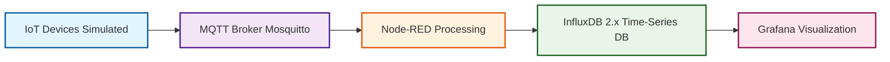

# 🌱 IoT Renewable Energy Monitoring System

> **A comprehensive IoT-based real-time monitoring system for renewable energy sources** including photovoltaic panels, wind turbines, biogas plants, heat boilers, and energy storage systems. Built with Node-RED, MQTT, InfluxDB 2.x, and Grafana using Docker containerization.

[](https://www.docker.com/)
[](https://mosquitto.org/)
[](https://www.influxdata.com/)
[](https://grafana.com/)
[](https://nodered.org/)

---

## 📋 Table of Contents

- [🏗️ System Architecture](#-system-architecture)
- [🚀 Quick Start Guide](#-quick-start-guide)
- [edubad.zut.edu.pl — Production Deployment](#edubad-zutedupl--main-production-deployment)
- [📊 Deployment Summary](#-deployment-summary)
- [🔧 Configuration](#-configuration)

---

## 🏗️ System Architecture

The system follows a **pipeline architecture** where data flows through multiple processing stages:

### 🔄 Data Flow Pipeline

```
┌─────────────────┐    ┌─────────────────┐    ┌─────────────────┐    ┌─────────────────┐
│   IoT Devices   │───▶│   MQTT Broker   │───▶│   Node-RED      │───▶│   InfluxDB 2.x  │
│   (Simulated)   │    │   (Mosquitto)   │    │   (Processing)  │    │   (Database)    │
│                 │    │                 │    │                 │    │                 │
│ • Photovoltaic  │    │ • Topic Routing │    │ • Data Validation│    │ • Time-series   │
│ • Wind Turbine  │    │ • Authentication│    │ • Transformation│    │ • Measurements  │
│ • Biogas Plant  │    │ • QoS Management│    │ • Aggregation   │    │ • Retention     │
│ • Heat Boiler   │    │ • Message Retain│    │ • Error Handling│    │ • Flux Queries  │
│ • Energy Storage│    │                 │    │ • Device Sim.   │    │                 │
└─────────────────┘    └─────────────────┘    └─────────────────┘    └─────────────────┘
                                                                              │
                                                                              ▼
                                                                   ┌─────────────────┐
                                                                   │   Grafana       │
                                                                   │ (Visualization) │
                                                                   │                 │
                                                                   │ • 7 Dashboards  │
                                                                   │ • Alerts        │
                                                                   │ • Analytics     │
                                                                   │ • Reports       │
                                                                   └─────────────────┘
```

> **💡 Note**: IoT devices are currently **simulated within Node-RED** using realistic mathematical models. The system is designed to easily integrate with real IoT devices by replacing simulation nodes with actual device connections.

### 🏭 FUXA SCADA Integration (Under Construction)

**FUXA** is a web-based Process Visualization (SCADA/HMI/Dashboard) software that will provide industrial-style Human Machine Interface (HMI) capabilities to our renewable energy monitoring system. 

- **🔗 Official Repository**: [FUXA by frangoteam](https://github.com/frangoteam/FUXA)
- **🎯 Purpose**: Additional visualization layer alongside Grafana and the custom React web app
- **🔧 Features**: Real-time monitoring, control interfaces, alarm management, and asset-specific dashboards
- **📊 Integration**: Will connect via MQTT to provide operator control interfaces and real-time asset management
- **🚧 Status**: Currently under development and integration planning

> **📋 Note**: FUXA SCADA integration is planned as an additional visualization layer to complement the existing Grafana dashboards and custom React web application, providing industrial HMI capabilities for renewable energy asset management.



---

## 🚀 Quick Start Guide

### **Prerequisites**

- **Docker & Docker Compose**: Latest version installed
- **Git**: For version control
- **SSH Access**: To your VPS (for production deployment)

### **Local Development (Windows)**

The local development environment uses **Nginx reverse proxy** on port **8080** to route requests to all services:

```powershell
# Clone the repository
git clone https://github.com/Viktar-T/plat-edu-bad-data-mvp.git
cd plat-edu-bad-data-mvp

# Start local development environment
.\scripts\dev-local.ps1

# Access all services through Nginx reverse proxy at http://localhost:8080:
- React Frontend: http://localhost:8080/app/
- Express API: http://localhost:8080/api/
- Health: http://localhost:8080/api/health
- Summary: http://localhost:8080/api/summary/{device}
- Grafana: http://localhost:8080/grafana/ (admin/admin)
- Node-RED: http://localhost:8080/nodered/ (admin/adminpassword)
- InfluxDB Admin: http://localhost:8080/influxdb/ (admin/admin_password_123)
- MQTT: localhost:1883 (admin/admin_password_456) - Direct connection only
```

> **💡 Note**: All web services are accessible through the Nginx reverse proxy on port 8080. MQTT broker (port 1883) requires direct connection as it uses the MQTT protocol, not HTTP.

### **Production Deployment**

Production deployments use **Nginx reverse proxy** for path-based routing, allowing all web services to be accessed through a single port with different paths. MQTT broker uses direct port access as it requires the MQTT protocol.

#### **Mikrus VPS (robert108.mikrus.xyz)**

```bash
# SSH to your VPS
ssh viktar@robert108.mikrus.xyz -p10108

# Clone the repository
git clone https://github.com/Viktar-T/plat-edu-bad-data-mvp.git
cd plat-edu-bad-data-mvp

# Set up environment
cp .env.production .env

# Fix permissions (IMPORTANT for VPS deployment)
sudo chown -R 472:472 ./grafana/data ./grafana/plugins
sudo chown -R 1000:1000 ./node-red/data
sudo chown -R 1883:1883 ./mosquitto/data ./mosquitto/log
sudo chown -R 472:472 ./influxdb/data
sudo chmod -R 755 ./grafana/data ./grafana/plugins ./node-red/data ./mosquitto/data ./mosquitto/log ./influxdb/data

# Start services
sudo docker-compose up -d

# Access your services through Nginx reverse proxy at http://robert108.mikrus.xyz:20108:
# - React Frontend: http://robert108.mikrus.xyz:20108/app/
# - Express API: http://robert108.mikrus.xyz:20108/api/
#   - Health: http://robert108.mikrus.xyz:20108/api/health
#   - Summary: http://robert108.mikrus.xyz:20108/api/summary/{device}
# - Grafana: http://robert108.mikrus.xyz:20108/grafana/ (admin/admin)
# - Node-RED: http://robert108.mikrus.xyz:20108/nodered/ (admin/adminpassword)
# - InfluxDB Admin: http://robert108.mikrus.xyz:20108/influxdb/ (admin/admin_password_123)
# - MQTT: robert108.mikrus.xyz:40098 (admin/admin_password_456) - Direct connection only
```

**Quick Access Links:**
- 🌐 [React Frontend](http://robert108.mikrus.xyz:20108/app/) - Main dashboard application
- 🔌 [Express API](http://robert108.mikrus.xyz:20108/api/) - REST API endpoints
- 📊 [Grafana Dashboards](http://robert108.mikrus.xyz:20108/grafana/) - Data visualization (admin/admin)
- 🔄 [Node-RED Editor](http://robert108.mikrus.xyz:20108/nodered/) - Flow editor (admin/adminpassword)
- 💾 [InfluxDB Admin](http://robert108.mikrus.xyz:20108/influxdb/) - Database administration (admin/admin_password_123)
- 📡 MQTT Broker: `robert108.mikrus.xyz:40098` - Direct connection (admin/admin_password_456)

> **💡 Note**: All web services are accessible through the Nginx reverse proxy on port **20108**. MQTT broker requires direct connection on port **40098** as it uses the MQTT protocol, not HTTP.

## **edubad.zut.edu.pl -- main Production Deployment**

**Server Information:**
- **Server**: [edubad.zut.edu.pl](http://edubad.zut.edu.pl/) (82.145.64.204)
- **Login**: `admin`
- **Password**: `XXXXXX`
- **Privileges**: Administrator access through `sudo`

**Port Availability:**
- ✅ **Ports verified and available**: 8080, 1883, 3000, 8086, 40098, 40099, 40100, 40101
- ✅ All required ports are free and ready for deployment

**Architecture:**
- **Nginx Reverse Proxy**: The project uses **Nginx reverse proxy** for path-based routing
- **Access Method**: All web services are accessible through Nginx on port **8080** (configurable)
- **MQTT**: Direct connection on port **40098** (MQTT protocol, not HTTP)

**Manual Deployment (Step-by-Step Guide):**

#### **Step 1: Connect to Server**

```bash
# SSH to your server
ssh admin@edubad.zut.edu.pl
# or using IP address
ssh admin@82.145.64.204
```

#### **Step 2: Clone Repository**

```bash
# Clone the repository
git clone https://github.com/Viktar-T/plat-edu-bad-data-mvp.git
cd plat-edu-bad-data-mvp

# or Pull the repository
git pull origin main

# Verify you're in the correct directory
pwd
# Should show: /home/admin/plat-edu-bad-data-mvp
```

#### **Step 3: Set Up Environment Configuration**

**Setup `.env.production` using SCP (Secure Copy) — Recommended**

If you have `.env.production` on your local machine and want to transfer it securely:

```powershell
# On your local Windows machine (PowerShell)
# Navigate to project directory
cd C:\Users\Vikta\Code\plat-edu-bad-data-mvp

# Transfer .env.production to server using SCP
scp .env.production admin@edubad.zut.edu.pl:~/plat-edu-bad-data-mvp/.env.production

# Or using IP address
scp .env.production admin@82.145.64.204:~/plat-edu-bad-data-mvp/.env.production

# If you need to specify SSH key
scp -i ~/.ssh/id_ed25519 .env.production admin@edubad.zut.edu.pl:~/plat-edu-bad-data-mvp/.env.production
```

**Then on the server, set secure permissions:**

```bash
# SSH to server
ssh admin@edubad.zut.edu.pl

# Navigate to project directory
cd ~/plat-edu-bad-data-mvp

# Set secure file permissions (owner read/write only)
chmod 600 .env.production

# Copy to .env (Docker Compose reads .env by default)
cp .env.production .env
chmod 600 .env

# Verify the files were set up correctly
ls -la .env.production .env
cat .env.production | grep -E "PASSWORD|TOKEN|SECRET"
```

> **💡 Note**: Docker Compose automatically reads `.env` file by default. We copy `.env.production` to `.env` so that `docker-compose up -d` works without needing the `--env-file` flag. This keeps the workflow simple and consistent.

#### **Transfer Method Comparison**

| Method | Security | Convenience | Best For |
|:-------|:---------|:-----------|:---------|
| **SCP** | ✅ Encrypted | ✅ Fast, automated | **Recommended: First-time setup and updates** |
| **SFTP** | ✅ Encrypted | ✅ GUI-friendly | Visual file management |
| **Copy-Paste** | ⚠️ Manual | ⚠️ Error-prone | Quick edits |
| **Git** | ❌ Not secure | ✅ Automated | ❌ Don't use for secrets |

**Our Approach:**

This project uses a **simplified MVP approach** that prioritizes ease of setup while maintaining basic security:

1. **Primary Method: SCP Transfer — Recommended**
   - ✅ **Best for MVP/Study projects**: Edit `.env.production` locally with your preferred tools, then transfer securely
   - ✅ **Consistent workflow**: Same method for first-time setup and updates
   - ✅ **Local editing**: Use your local editor (VS Code, Notepad++, etc.) instead of server-side editors
   - ✅ **Secure transfer**: Encrypted via SSH
   - ✅ **Fast and automated**: Single command to transfer
   - ✅ **Version control**: Keep `.env.production` locally (not in Git) for your own tracking

2. **Why Not Git for `.env.production`?**
   - ❌ **Security risk**: Even in private repos, secrets shouldn't be committed
   - ❌ **Git history**: Once committed, secrets remain in history forever

2. **Docker Compose Environment File Behavior:**
   - 📝 **Default behavior**: `docker-compose up -d` automatically reads `.env` file (not `.env.production`)
   - 📝 **Why we copy**: After transferring/creating `.env.production`, we copy it to `.env` so Docker Compose can read it automatically
   - 📝 **Alternative**: You can use `docker-compose --env-file .env.production up -d` instead, but copying to `.env` is simpler

3. **Security Notes:**
   - 🔒 Always set `chmod 600 .env.production .env` after creation/transfer (owner read/write only)
   - 🔒 Use SCP/SFTP for encrypted transfer when updating files
   - 🔒 For production deployments, change all default passwords
   - 🔒 Never commit `.env.production` or `.env` to Git (only the template)

**What's in `.env.production`?**
- ✅ All default passwords are already included
- ✅ All tokens are already included
- ✅ Server configuration (ports, URLs)
- ✅ Service configurations

**Default Passwords (already in template):**
- **MQTT**: `admin` / `admin_password_456`
- **InfluxDB**: `admin` / `admin_password_123`
- **InfluxDB Token**: `simple_token_12345678901234567890123456789012`
- **Node-RED**: `admin` / `adminpassword`
- **Node-RED Secret**: `simple_secret_12345678901234567890123456789012`
- **Grafana**: `admin` / `admin`

#### **Step 4: Create Required Directories**

```bash
# Create data directories for Docker volumes
mkdir -p grafana/data grafana/plugins
mkdir -p node-red/data
mkdir -p mosquitto/data mosquitto/log
mkdir -p influxdb/data

# Verify directories were created
ls -la grafana/ node-red/ mosquitto/ influxdb/
```

#### **Step 5: Fix Directory Permissions (IMPORTANT)**

Docker containers run as specific user IDs and need proper permissions to write data:

```bash
# Fix Grafana permissions (runs as user ID 472)
sudo chown -R 472:472 ./grafana/data ./grafana/plugins

# Fix Node-RED permissions (runs as user ID 1000)
sudo chown -R 1000:1000 ./node-red/data

# Fix Mosquitto permissions (runs as user ID 1883)
sudo chown -R 1883:1883 ./mosquitto/data ./mosquitto/log

# Fix InfluxDB permissions (runs as user ID 472)
sudo chown -R 472:472 ./influxdb/data

# Set directory permissions (readable/executable by all, writable by owner)
sudo chmod -R 755 ./grafana/data ./grafana/plugins ./node-red/data ./mosquitto/data ./mosquitto/log ./influxdb/data

# Verify permissions
ls -la grafana/data node-red/data mosquitto/data influxdb/data
```

**Why this is important:**
- Without proper permissions, containers will fail to start or restart repeatedly
- Each service runs as a specific user ID for security
- Data directories must be writable by these users

#### **Step 6: Verify Docker and Docker Compose**

```bash
# Check Docker is installed and running
sudo docker --version
sudo systemctl status docker

# Check Docker Compose is available
sudo docker-compose --version
# or
sudo docker compose version

# Test Docker with a simple command
sudo docker run hello-world
```

#### **Step 7: Start Services**

```bash
# Start all services in detached mode
sudo docker-compose up -d
```

#### **Step 8: Verify Services Are Running**

```bash
# Check container status
sudo docker-compose ps

# Expected output: All containers should show "Up" status
# - iot-mosquitto
# - iot-influxdb2
# - iot-node-red
# - iot-grafana
# - iot-nginx
# - iot-api
# - iot-frontend

# Check container logs (if any are not running)
sudo docker-compose logs [service-name]
# Example: sudo docker-compose logs influxdb

# Check all logs
sudo docker-compose logs --tail=50
```

#### **Step 9: Verify Services Are Healthy**

```bash
# Wait a few seconds for services to initialize
sleep 10

# Check container health
sudo docker ps --format "table {{.Names}}\t{{.Status}}\t{{.Ports}}"

# Test MQTT connection
sudo docker exec iot-mosquitto mosquitto_pub -h localhost -u admin -P admin_password_456 -t test/topic -m "test"

# Test InfluxDB (should return HTTP 204)
curl -I http://localhost:8086/health

# Test Node-RED (should return HTTP 200)
curl -I http://localhost:1880

# Test Grafana (should return HTTP 200)
curl -I http://localhost:3000
```

#### **Step 10: Access Your Services**

Once services are running, access them through the Nginx reverse proxy:

**Web Services (via Nginx on port 8080):**
- 🌐 **React Frontend**: http://edubad.zut.edu.pl:8080/app/
- 🔌 **Express API**: http://edubad.zut.edu.pl:8080/api/
  - Health Check: http://edubad.zut.edu.pl:8080/api/health
  - Summary Endpoint: http://edubad.zut.edu.pl:8080/api/summary/{device}
- 📊 **Grafana Dashboards**: http://edubad.zut.edu.pl:8080/grafana/ (admin/admin)
- 🔄 **Node-RED Editor**: http://edubad.zut.edu.pl:8080/nodered/ (admin/adminpassword)
- 💾 **InfluxDB Admin**: http://edubad.zut.edu.pl:8080/influxdb/ (admin/admin_password_123)

**Direct Access (MQTT only):**
- 📡 **MQTT Broker**: `edubad.zut.edu.pl:40098` (admin/admin_password_456)
- 📡 **MQTT WebSocket**: `edubad.zut.edu.pl:9001`

#### **Step 11: Common Management Commands**

```bash
# View service status
sudo docker-compose ps

# View logs for all services
sudo docker-compose logs -f

# View logs for specific service
sudo docker-compose logs -f [service-name]
# Examples:
sudo docker-compose logs -f influxdb
sudo docker-compose logs -f node-red
sudo docker-compose logs -f grafana

# Restart a specific service
sudo docker-compose restart [service-name]

# Restart all services
sudo docker-compose restart

# Stop all services
sudo docker-compose down

# Stop and remove all containers (keeps data)
sudo docker-compose down

# Stop and remove everything including volumes (⚠️ deletes data)
sudo docker-compose down -v

# Update and restart services (after git pull)
git pull
sudo docker-compose up -d --build
```

#### **Troubleshooting**

**If containers fail to start:**

```bash
# Check logs for errors
sudo docker-compose logs [service-name]

# Check if ports are already in use
sudo netstat -tlnp | grep -E "(8080|1883|3000|8086|40098)"

# Check disk space
df -h

# Check Docker system resources
sudo docker system df

# Restart Docker daemon (if needed)
sudo systemctl restart docker
```

**If permission errors occur:**

```bash
# Re-run permission fixes
sudo chown -R 472:472 ./grafana/data ./grafana/plugins
sudo chown -R 1000:1000 ./node-red/data
sudo chown -R 1883:1883 ./mosquitto/data ./mosquitto/log
sudo chown -R 472:472 ./influxdb/data
sudo chmod -R 755 ./grafana/data ./grafana/plugins ./node-red/data ./mosquitto/data ./mosquitto/log ./influxdb/data

# Restart services
sudo docker-compose restart
```

**If services are not accessible:**

```bash
# Check if containers are running
sudo docker ps

# Check if Nginx is routing correctly
sudo docker-compose logs nginx

# Test internal connectivity
sudo docker exec iot-nginx curl http://iot-grafana:3000
sudo docker exec iot-nginx curl http://iot-node-red:1880
sudo docker exec iot-nginx curl http://iot-influxdb2:8086/health
```


> **💡 Note**: 
> - **Nginx Reverse Proxy**: All web services are accessible through the Nginx reverse proxy on port **8080**. MQTT broker requires direct connection on port **40098** as it uses the MQTT protocol, not HTTP.
> - **Port Availability**: Ports 8080, 1883, 3000, 8086, 40098, 40099, 40100, 40101 are verified and available for deployment.
> - **Simplified Approach**: Single `.env.production` file with all configuration including simple default passwords (MVP/Study version).
> - The `admin` user has administrator privileges through `sudo`.

### **📊 Deployment Summary**

#### **Configuration Comparison**

| Aspect | Local Development | Production (edubad.zut.edu.pl) | Production (Mikrus VPS) |
|:-------|:------------------|:-------------------------------|:------------------------|
| **Docker Compose File** | `docker-compose.local.yml` | `docker-compose.yml` | `docker-compose.yml` |
| **Environment File** | `.env.local` | `.env.production` | `.env.production` |
| **Nginx Port** | `8080` | `8080` | `20108` |
| **MQTT Port** | `1883` | `40098` | `40098` |
| **Base URL** | `http://localhost:8080` | `http://edubad.zut.edu.pl:8080` | `http://robert108.mikrus.xyz:20108` |
| **Container Names** | `iot-*-local` | `iot-*` | `iot-*` |
| **Network Name** | `iot-network-local` | `iot-network` | `iot-network` |
| **Node-RED Config** | `settings.local.js` | `settings.js` | `settings.js` |
| **Nginx Config** | `nginx.local.conf` | `nginx.conf` | `nginx.conf` |
| **Node Environment** | `development` | `production` | `production` |
| **Environment Variables** | Hardcoded in compose file | From `.env.production` | From `.env.production` |
| **Command** | `docker-compose -f docker-compose.local.yml up -d` | `docker-compose up -d` | `docker-compose up -d` |

#### **Quick Access URLs**

| Service | Local | edubad.zut.edu.pl | Mikrus VPS |
|:--------|:------|:------------------|:-----------|
| **React Frontend** | http://localhost:8080/app/ | http://edubad.zut.edu.pl:8080/app/ | http://robert108.mikrus.xyz:20108/app/ |
| **Express API** | http://localhost:8080/api/ | http://edubad.zut.edu.pl:8080/api/ | http://robert108.mikrus.xyz:20108/api/ |
| **Grafana** | http://localhost:8080/grafana/ | http://edubad.zut.edu.pl:8080/grafana/ | http://robert108.mikrus.xyz:20108/grafana/ |
| **Node-RED** | http://localhost:8080/nodered/ | http://edubad.zut.edu.pl:8080/nodered/ | http://robert108.mikrus.xyz:20108/nodered/ |
| **InfluxDB Admin** | http://localhost:8080/influxdb/ | http://edubad.zut.edu.pl:8080/influxdb/ | http://robert108.mikrus.xyz:20108/influxdb/ |
| **MQTT Broker** | `localhost:1883` | `edubad.zut.edu.pl:40098` | `robert108.mikrus.xyz:40098` |

**Default Credentials (All Environments):**
- **Grafana**: `admin` / `admin`
- **Node-RED**: `admin` / `adminpassword`
- **InfluxDB**: `admin` / `admin_password_123`
- **MQTT**: `admin` / `admin_password_456`


---


## 🔧 Configuration

### **Environment Variables**

The system uses a **simplified approach** with a single `.env.production` file containing all configuration including simple default passwords (MVP/Study version).

**Setup:**

Create `.env.production` locally with all required configuration values (passwords, tokens, server settings, ports, URLs). Then transfer it to the server using SCP as described in the deployment steps above.

**Default Passwords (MVP/Study Version):**
- **MQTT**: `admin` / `admin_password_456`
- **InfluxDB**: `admin` / `admin_password_123`
- **Node-RED**: `admin` / `adminpassword`
- **Grafana**: `admin` / `admin`

**Benefits:**
- ✅ **Simple**: Single file with all configuration
- ✅ **Ready to use**: Default passwords included (no generation needed)
- ✅ **Consistent**: Same structure across environments
- ✅ **Easy to manage**: One file to edit

### **Key Configuration Sections**

- **MQTT Broker**: Port, authentication, logging
- **InfluxDB 2.x**: Database, retention, authentication
- **Node-RED**: Authentication, InfluxDB integration
- **Grafana**: Authentication, InfluxDB data source
- **Development**: Simulation settings, debug modes
- **Production**: Security settings, performance tuning

### **Security Best Practices**

- 🔒 **Never commit** `.env.production` to Git (template is safe)
- 🔒 **Set file permissions**: `chmod 600 .env.production` (owner read/write only)
- 🔒 **Change default passwords**: For production use, update passwords in `.env.production`
- 🔒 **Transfer securely**: Via SCP (encrypted SSH connection)

> **⚠️ Note**: This MVP/Study version uses simple default passwords. For production deployments, change all default passwords!

### **Data Retention**

```bash
# Default retention policy: 30 days
INFLUXDB_RETENTION=30d

# Custom retention policies
CUSTOM_RETENTION_POLICIES=system_metrics:7d,alerts:90d,analytics:365d
```

---

