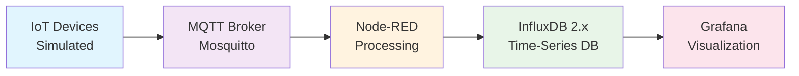

# 🌱 IoT Renewable Energy Monitoring System

> **A comprehensive IoT-based real-time monitoring system for renewable energy sources** including photovoltaic panels, wind turbines, biogas plants, heat boilers, and energy storage systems. Built with Node-RED, MQTT, InfluxDB 2.x, and Grafana using Docker containerization.

[](https://www.docker.com/)
[](https://mosquitto.org/)
[](https://www.influxdata.com/)
[](https://grafana.com/)
[](https://nodered.org/)

---

## 📋 Table of Contents

- [🏗️ System Architecture](#️-system-architecture)
- [🚀 Quick Start Guide](#-quick-start-guide)
- [📁 Project Structure](#-project-structure)
- [🔐 MQTT Configuration](#-mqtt-configuration)
- [🧪 Testing Framework](#-testing-framework)
- [🔧 Configuration](#-configuration)
- [📊 Data Flow](#-data-flow)
- [📈 Grafana Dashboards](#-grafana-dashboards)
- [🛡️ Security](#️-security)
- [📈 Monitoring](#-monitoring)
- [🔄 Development](#-development)
- [📚 Documentation](#-documentation)
- [🤝 Contributing](#-contributing)
- [🆘 Support](#-support)

---

## 🏗️ System Architecture

The system follows a **pipeline architecture** where data flows through multiple processing stages:

### 🔄 Data Flow Pipeline

```
┌─────────────────┐    ┌─────────────────┐    ┌─────────────────┐    ┌─────────────────┐
│   IoT Devices   │───▶│   MQTT Broker   │───▶│   Node-RED      │───▶│   InfluxDB 2.x  │
│   (Simulated)   │    │   (Mosquitto)   │    │   (Processing)  │    │   (Database)    │
│                 │    │                 │    │                 │    │                 │
│ • Photovoltaic  │    │ • Topic Routing │    │ • Data Validation│    │ • Time-series   │
│ • Wind Turbine  │    │ • Authentication│    │ • Transformation│    │ • Measurements  │
│ • Biogas Plant  │    │ • QoS Management│    │ • Aggregation   │    │ • Retention     │
│ • Heat Boiler   │    │ • Message Retain│    │ • Error Handling│    │ • Flux Queries  │
│ • Energy Storage│    │                 │    │ • Device Sim.   │    │                 │
└─────────────────┘    └─────────────────┘    └─────────────────┘    └─────────────────┘
                                                                              │
                                                                              ▼
                                                                   ┌─────────────────┐
                                                                   │   Grafana       │
                                                                   │ (Visualization) │
                                                                   │                 │
                                                                   │ • Dashboards    │
                                                                   │ • Alerts        │
                                                                   │ • Analytics     │
                                                                   │ • Reports       │
                                                                   └─────────────────┘
```

> **💡 Note**: IoT devices are currently **simulated within Node-RED** using realistic mathematical models. The system is designed to easily integrate with real IoT devices by replacing simulation nodes with actual device connections.

### 🏭 FUXA SCADA Integration (Under Construction)

**FUXA** is a web-based Process Visualization (SCADA/HMI/Dashboard) software that will provide industrial-style Human Machine Interface (HMI) capabilities to our renewable energy monitoring system. 

- **🔗 Official Repository**: [FUXA by frangoteam](https://github.com/frangoteam/FUXA)
- **🎯 Purpose**: Additional visualization layer alongside Grafana and the custom React web app
- **🔧 Features**: Real-time monitoring, control interfaces, alarm management, and asset-specific dashboards
- **📊 Integration**: Will connect via MQTT to provide operator control interfaces and real-time asset management
- **🚧 Status**: Currently under development and integration planning

> **📋 Note**: FUXA SCADA integration is planned as an additional visualization layer to complement the existing Grafana dashboards and custom React web application, providing industrial HMI capabilities for renewable energy asset management.



### 🔄 Data Flow Pipeline

```
┌─────────────────┐    ┌─────────────────┐    ┌─────────────────┐    ┌─────────────────┐
│   IoT Devices   │───▶│   MQTT Broker   │───▶│   Node-RED      │───▶│   InfluxDB 2.x  │
│   (Simulated)   │    │   (Mosquitto)   │    │   (Processing)  │    │   (Database)    │
│                 │    │                 │    │                 │    │                 │
│ • Photovoltaic  │    │ • Topic Routing │    │ • Data Validation│    │ • Time-series   │
│ • Wind Turbine  │    │ • Authentication│    │ • Transformation│    │ • Measurements  │
│ • Biogas Plant  │    │ • QoS Management│    │ • Aggregation   │    │ • Retention     │
│ • Heat Boiler   │    │ • Message Retain│    │ • Error Handling│    │ • Flux Queries  │
│ • Energy Storage│    │                 │    │ • Device Sim.   │    │                 │
└─────────────────┘    └─────────────────┘    └─────────────────┘    └─────────────────┘
                                                                              │
                                                                              ▼
                                                                   ┌─────────────────┐
                                                                   │   Grafana       │
                                                                   │ (Visualization) │
                                                                   │                 │
                                                                   │ • Dashboards    │
                                                                   │ • Alerts        │
                                                                   │ • Analytics     │
                                                                   │ • Reports       │
                                                                   └─────────────────┘
```

> **💡 Note**: IoT devices are currently **simulated within Node-RED** using realistic mathematical models. The system is designed to easily integrate with real IoT devices by replacing simulation nodes with actual device connections.

---

## 🚀 Quick Start Guide

### 📋 Prerequisites

Before you begin, ensure you have the following installed:

- ✅ **Docker** and **Docker Compose** - For containerization
- ✅ **Git** - For version control
- ✅ **PowerShell** (Windows) - For testing scripts

### 🛠️ Installation Steps

#### 1. **Clone the Repository**
```bash
git clone <repository-url>
cd plat-edu-bad-data-mvp
```

#### 2. **Configure Environment Variables**
```bash
# Copy the example environment file
cp env.example .env

# Edit the .env file with your preferred settings
# (See Configuration section for details)
```

#### 3. **Start All Services**
```bash
# Start all services in detached mode
docker-compose up -d

# Verify services are running
docker-compose ps
```

#### 4. **Access Web Interfaces**

| Service | URL | Default Credentials |
|---------|-----|-------------------|
| **Node-RED** | http://localhost:1880 | `admin` / `adminpassword` |
| **Grafana** | http://localhost:3000 | `admin` / `admin` |
| **InfluxDB** | http://localhost:8086 | `admin` / `admin_password_123` |
| **MQTT** | localhost:1883 | `admin` / `admin_password_456` |

> **🔑 API Token for InfluxDB**: `renewable_energy_admin_token_123`

#### 5. **Run Comprehensive Tests**
```powershell
# Navigate to tests directory
cd tests

# Run all tests
.\run-all-tests.ps1

# Or run individual tests
.\scripts\test-mqtt.ps1 -PublishTest -Topic "test/hello" -Message "Hello World!"
.\scripts\test-data-flow.ps1
.\scripts\test-flux-queries.ps1
```

---

## 📁 Project Structure

```
plat-edu-bad-data-mvp/
├── 📄 docker-compose.yml          # Docker services configuration
├── 📄 env.example                 # Environment variables template
├── 📄 README.md                   # This file
├── 📁 docs/                       # 📚 Documentation
│   ├── 📄 architecture.md         # System architecture details
│   ├── 📄 mqtt-configuration.md   # MQTT broker configuration guide
│   └── 📁 decisions/              # Architecture decision records
├── 📁 mosquitto/                  # 🐝 MQTT broker configuration
│   └── 📁 config/
│       ├── 📄 mosquitto.conf      # Main broker configuration
│       ├── 📄 passwd              # Password file (generated)
│       └── 📄 acl                 # Access control list
├── 📁 node-red/                   # 🔄 Node-RED configuration
│   ├── 📁 flows/                  # Node-RED flow files
│   │   ├── 📄 v2.0-pv-mqtt-loop-simulation.json
│   │   ├── 📄 v2.1-pv-mqtt-loop-simulation.json
│   │   └── 📄 FLUX_MIGRATION_SUMMARY.md
│   └── 📁 data/                   # Node-RED data directory
├── 📁 influxdb/                   # 📊 InfluxDB 2.x configuration
│   ├── 📁 config/                 # InfluxDB configuration files
│   ├── 📁 data/                   # Time-series data storage
│   └── 📁 backups/                # Database backups
├── 📁 grafana/                    # 📈 Grafana configuration
│   ├── 📁 dashboards/             # Pre-configured dashboards
│   │   ├── 📄 renewable-energy-overview.json
│   │   ├── 📄 photovoltaic-monitoring.json
│   │   ├── 📄 wind-turbine-analytics.json
│   │   ├── 📄 biogas-plant-metrics.json
│   │   ├── 📄 heat-boiler-monitoring.json
│   │   └── 📄 energy-storage-monitoring.json
│   └── 📁 provisioning/           # Auto-provisioning configuration
├── 📁 scripts/                    # 🛠️ Utility scripts
│   ├── 📄 deploy-mqtt-loop.ps1   # MQTT loop deployment
│   ├── 📄 convert-all-flows.ps1  # Flow conversion utilities
│   └── 📄 influx3-setup.ps1      # InfluxDB setup utilities
└── 📁 tests/                     # 🧪 Comprehensive testing framework
    ├── 📄 run-all-tests.ps1      # Main test runner
    ├── 📁 scripts/               # Individual test scripts
    │   ├── 📄 test-mqtt.ps1      # MQTT connectivity testing
    │   ├── 📄 test-data-flow.ps1 # End-to-end data flow testing
    │   ├── 📄 test-flux-queries.ps1 # Flux query testing
    │   ├── 📄 test-integration.ps1 # Component integration testing
    │   └── 📄 test-performance.ps1 # Performance testing
    ├── 📁 javascript/            # JavaScript API testing
    │   ├── 📄 test-influxdb-api.js
    │   ├── 📄 test-config.json
    │   └── 📄 package.json
    └── 📁 data/                  # Test data files
        └── 📁 test-messages/     # Sample device messages
```

---

## 🔐 MQTT Configuration

### 📡 Topic Structure

The system uses a **hierarchical topic structure** for scalable messaging:

```
devices/{device_type}/{device_id}/{data_type}
```

#### 📋 Topic Categories

| Category | Pattern | Description |
|----------|---------|-------------|
| **Device Data** | `devices/{device_type}/{device_id}/data` | Telemetry data from devices |
| **Device Status** | `devices/{device_type}/{device_id}/status` | Operational status updates |
| **Device Commands** | `devices/{device_type}/{device_id}/commands` | Control commands to devices |
| **System Health** | `system/health/{service_name}` | Service health monitoring |
| **System Alerts** | `system/alerts/{severity}` | System alerts and notifications |

#### 🔌 Supported Device Types

- 🌞 **`photovoltaic`** - Solar panel systems
- 💨 **`wind_turbine`** - Wind power generators
- ⛽ **`biogas_plant`** - Biogas production facilities
- 🔥 **`heat_boiler`** - Thermal energy systems
- 🔋 **`energy_storage`** - Battery storage systems

### 🛡️ Security Features

| Feature | Status | Description |
|---------|--------|-------------|
| ✅ **Authentication** | Enabled | Username/password for all devices and services |
| ✅ **Access Control** | Enabled | Topic-based permissions with ACL |
| ✅ **No Anonymous Access** | Enabled | Anonymous connections disabled |
| ✅ **Persistence** | Enabled | Message storage and recovery |
| ✅ **Logging** | Enabled | Comprehensive logging for monitoring |
| ✅ **WebSocket Support** | Enabled | Web application connectivity on port 9001 |

### 📝 Example Topics

```bash
# Device data examples
devices/photovoltaic/pv_001/data
devices/wind_turbine/wt_001/status
devices/energy_storage/es_001/commands

# System monitoring examples
system/health/mosquitto
system/alerts/critical
```

---

## 🧪 Testing Framework

### 🔬 Comprehensive Testing Suite

The project includes a complete testing framework with **PowerShell scripts** and **JavaScript API tests**:

#### 📜 PowerShell Testing Scripts

| Script | Purpose | Features |
|--------|---------|----------|
| **`test-mqtt.ps1`** | MQTT connectivity and message testing | Connection validation, message publishing/subscribing |
| **`test-data-flow.ps1`** | End-to-end data flow validation | Complete pipeline testing |
| **`test-flux-queries.ps1`** | InfluxDB Flux query testing | Query validation and performance |
| **`test-integration.ps1`** | Component integration testing | Service interaction validation |
| **`test-performance.ps1`** | Performance and load testing | Throughput and latency measurement |

#### 🟨 JavaScript API Testing

| File | Purpose |
|------|---------|
| **`test-influxdb-api.js`** | InfluxDB API testing with Node.js |
| **`test-config.json`** | Centralized test configuration |
| **`package.json`** | Node.js dependencies for testing |

#### 🏃‍♂️ Test Runner

- **`run-all-tests.ps1`** - Comprehensive test execution with detailed reporting

### 🚀 Running Tests

```powershell
# Navigate to tests directory
cd tests

# Run all tests
.\run-all-tests.ps1

# Run individual tests
.\scripts\test-mqtt.ps1 -PublishTest -Topic "test/hello" -Message "Hello World!"
.\scripts\test-data-flow.ps1
.\scripts\test-flux-queries.ps1
.\scripts\test-integration.ps1
.\scripts\test-performance.ps1

# JavaScript API tests
cd javascript
npm install
node test-influxdb-api.js
```

---

## 🔧 Configuration

### 🌍 Environment Variables

Copy `env.example` to `.env` and configure:

```bash
# MQTT Configuration
MQTT_PORT=1883
MQTT_WS_PORT=9001
MQTT_ADMIN_USER=admin
MQTT_ADMIN_PASSWORD=admin_password_456

# InfluxDB 2.x Configuration
INFLUXDB_ADMIN_USER=admin
INFLUXDB_ADMIN_PASSWORD=admin_password_123
INFLUXDB_ADMIN_TOKEN=renewable_energy_admin_token_123
INFLUXDB_ORG=renewable_energy_org
INFLUXDB_BUCKET=renewable_energy
INFLUXDB_RETENTION=30d

# Node-RED Configuration
NODE_RED_USERNAME=admin
NODE_RED_PASSWORD=adminpassword

# Grafana Configuration
GRAFANA_ADMIN_USER=admin
GRAFANA_ADMIN_PASSWORD=admin
```

### 🔌 Service Ports

| Service | Port | Protocol | Description |
|---------|------|----------|-------------|
| **MQTT Broker** | 1883 | MQTT | Main MQTT protocol |
| **MQTT WebSocket** | 9001 | WebSocket | Web application connectivity |
| **Node-RED** | 1880 | HTTP | Web UI and API |
| **InfluxDB** | 8086 | HTTP | Web interface and API |
| **Grafana** | 3000 | HTTP | Web UI and dashboards |

---

## 📊 Data Flow

### 🔄 Processing Pipeline

1. **🌞 Node-RED Device Simulation** generates realistic IoT device data using mathematical models
2. **🐝 MQTT Broker** routes messages based on topic structure
3. **🔄 Node-RED Processing** validates and transforms data using Flux format
4. **📊 InfluxDB 2.x** stores time-series data with proper retention policies
5. **📈 Grafana** visualizes data through pre-configured dashboards and alerts

### 🎯 Simulation Details

The system currently uses Node-RED flows to simulate photovoltaic panels with realistic models:

- **`v2.0-pv-mqtt-loop-simulation.json`** - Basic photovoltaic simulation
- **`v2.1-pv-mqtt-loop-simulation.json`** - Enhanced photovoltaic simulation with Flux integration

**Simulation Features:**
- 🌞 **Realistic Solar Models**: Irradiance based on time of day and season
- 🌡️ **Temperature Effects**: Panel temperature modeling with efficiency calculations
- ⚠️ **Fault Scenarios**: Random fault injection (shading, temperature, connection issues)
- ✅ **Data Validation**: Comprehensive data range and consistency checks
- 🔄 **Flux Integration**: Proper data conversion for InfluxDB 2.x storage

### 📝 Example Data Format

```json
{
  "device_id": "pv_001",
  "device_type": "photovoltaic",
  "timestamp": "2024-01-15T10:30:00Z",
  "data": {
    "irradiance": 850.5,
    "temperature": 45.2,
    "voltage": 48.3,
    "current": 12.1,
    "power_output": 584.43
  },
  "status": "operational",
  "location": "site_a"
}
```

### 🔍 Flux Query Examples

```flux
// Data writing with Flux format
from(bucket: "renewable_energy")
  |> range(start: -1h)
  |> filter(fn: (r) => r._measurement == "photovoltaic_data")
  |> filter(fn: (r) => r.device_type == "photovoltaic")

// Data reading with aggregation
from(bucket: "renewable_energy")
  |> range(start: -5m)
  |> filter(fn: (r) => r.device_type == "photovoltaic")
  |> filter(fn: (r) => r._field == "power_output" or r._field == "efficiency")
  |> pivot(rowKey:["_time"], columnKey: ["_field"], valueColumn: "_value")
```

---

## 📈 Grafana Dashboards

### 📊 Pre-Configured Dashboards

The system includes comprehensive dashboards for all device types:

| Dashboard | Description | Features |
|-----------|-------------|----------|
| **🌱 Renewable Energy Overview** | System-wide monitoring | Overall system performance and health |
| **🌞 Photovoltaic Monitoring** | Solar panel performance metrics | Power output, efficiency, temperature |
| **💨 Wind Turbine Analytics** | Wind power generation analysis | Wind speed, power curve, performance |
| **⛽ Biogas Plant Metrics** | Biogas production monitoring | Gas flow, methane content, efficiency |
| **🔥 Heat Boiler Monitoring** | Thermal energy system tracking | Temperature, pressure, efficiency |
| **🔋 Energy Storage Monitoring** | Battery storage analytics | State of charge, charge/discharge cycles |

### 🎨 Dashboard Features

- 📊 **Real-time data visualization**
- 📈 **Historical trend analysis**
- 📋 **Performance metrics and KPIs**
- 🔔 **Alert configuration**
- 📱 **Responsive design** for multiple screen sizes

---

## 🛡️ Security

### 🔐 Authentication

- ✅ Each device has unique credentials
- ✅ Service accounts for Node-RED, Grafana, and monitoring
- ✅ Admin account for system management
- 🔄 Regular password rotation recommended

### 🚪 Access Control

- ✅ Device-specific topic permissions
- ✅ Service accounts with appropriate read/write access
- ✅ Wildcard permissions for scalable device management
- ✅ Principle of least privilege enforced

### 🌐 Network Security

- 🔥 Firewall rules for MQTT ports
- 🔒 SSL/TLS encryption for production (configured but disabled by default)
- 🌍 Network segmentation for IoT devices
- 🔐 VPN access for remote management

---

## 📈 Monitoring

### 🏥 Health Checks

All services include Docker health checks:

```bash
# Check service health
docker-compose ps

# View service logs
docker-compose logs mosquitto
docker-compose logs node-red
docker-compose logs influxdb
docker-compose logs grafana
```

### 📊 Metrics

- 📈 Connection count and message throughput
- 🚫 Authentication failures and access violations
- 💻 System resource usage
- ⚡ Data processing performance

---

## 🔄 Development

### ➕ Adding New Devices

#### 1. **Generate Device Credentials**
```bash
mosquitto_passwd -b mosquitto/config/passwd new_device_id new_password
```

#### 2. **Add ACL Permissions**
```bash
# Add to mosquitto/config/acl
topic write devices/device_type/new_device_id/data
topic write devices/device_type/new_device_id/status
topic read devices/device_type/new_device_id/commands
```

#### 3. **Update Environment Variables**
```bash
# Add to .env
NEW_DEVICE_ID_PASSWORD=new_password
```

### 🔄 Node-RED Flow Development

The system includes two main flow versions for **device simulation**:

| Flow Version | Description | Features |
|--------------|-------------|----------|
| **`v2.0-pv-mqtt-loop-simulation.json`** | Basic photovoltaic simulation | Realistic solar models, basic data validation |
| **`v2.1-pv-mqtt-loop-simulation.json`** | Enhanced photovoltaic simulation | Flux integration, advanced error handling |

**Simulation Features:**
- 🌞 **Realistic Solar Models**: Irradiance based on time of day and season
- 🌡️ **Temperature Effects**: Panel temperature modeling with efficiency calculations
- ⚠️ **Fault Scenarios**: Random fault injection (shading, temperature, connection issues)
- ✅ **Data Validation**: Comprehensive data range and consistency checks
- 🔄 **Flux Integration**: Proper data conversion for InfluxDB 2.x storage

### 🔄 Flux Migration

The system has been migrated to use **InfluxDB 2.x** with Flux query language:

- ✅ Token-based authentication
- ✅ Flux-compatible data structure
- ✅ Proper organization and bucket configuration
- ✅ Advanced query capabilities

---

## 📚 Documentation

### 📖 Core Documentation

- [🏗️ System Architecture](docs/architecture.md) - Detailed system design
- [🐝 MQTT Configuration](docs/mqtt-configuration.md) - Complete MQTT setup guide
- [🔄 Development Workflow](docs/development-workflow.md) - Development guidelines
- [📋 Architecture Decisions](docs/decisions/) - Design decision records
- [🧪 Testing Implementation](tests/TESTING_IMPLEMENTATION_SUMMARY.md) - Testing framework details
- [🔄 Flux Migration](node-red/flows/FLUX_MIGRATION_SUMMARY.md) - InfluxDB 2.x migration details

### 📊 InfluxDB 2.x Documentation

- [📖 InfluxDB 2.x Overview](docs/influxdb2/README.md) - Complete InfluxDB 2.x system overview and quick start
- [🏗️ InfluxDB 2.x Architecture](docs/influxdb2/architecture.md) - Detailed InfluxDB 2.x architecture and data flow
- [⚙️ InfluxDB 2.x Configuration](docs/influxdb2/configuration.md) - Comprehensive configuration reference
- [📋 InfluxDB 2.x Implementation Summary](docs/influxdb2/IMPLEMENTATION_SUMMARY.md) - Complete implementation details and verification

---

## 🤝 Contributing

We welcome contributions! Here's how you can help:

1. 🍴 **Fork the repository**
2. 🌿 **Create a feature branch**
3. ✏️ **Make your changes**
4. 🧪 **Add tests if applicable**
5. 📤 **Submit a pull request**

---

## 📄 License

This project is licensed under the **MIT License** - see the LICENSE file for details.

---

## 🆘 Support

For issues and questions:

1. 📚 Check the [documentation](docs/)
2. 🔧 Review [troubleshooting guide](docs/mqtt-configuration.md#troubleshooting)
3. 🧪 Run the [testing framework](tests/) to diagnose issues
4. 🐛 Open an issue on GitHub
5. 📧 Contact the development team

---

## 🔄 Updates

### 📅 Recent Changes

- ✅ Complete MQTT broker configuration with authentication
- ✅ Topic-based access control implementation
- ✅ Comprehensive testing framework with PowerShell and JavaScript
- ✅ InfluxDB 2.x migration with Flux query language
- ✅ Pre-configured Grafana dashboards for all device types
- ✅ Node-RED flows with Flux data conversion
- ✅ Security best practices documentation
- ✅ Environment variable configuration
- ✅ Docker service integration with health checks
- ✅ **NEW**: Complete InfluxDB 2.x documentation suite (README, Architecture, Configuration)
- ✅ **NEW**: InfluxDB 2.x initialization and user setup scripts
- ✅ **NEW**: Node-RED flow consistency fixes for InfluxDB 2.x integration
- ✅ **NEW**: Comprehensive implementation summary and verification checklist

### 📊 Current Implementation Status

| Component | Status | Description |
|-----------|--------|-------------|
| 🐝 **MQTT Broker** | ✅ Complete | Fully configured with authentication and ACL |
| 📊 **InfluxDB 2.x** | ✅ Complete | Migrated from 1.x with Flux queries |
| 🔄 **Node-RED** | ✅ Complete | Flows with Flux data conversion |
| 📈 **Grafana** | ✅ Complete | Complete dashboard suite |
| 🧪 **Testing** | ✅ Complete | Comprehensive PowerShell and JavaScript testing framework |
| 📚 **Documentation** | ✅ Complete | Complete system documentation |
| 🐳 **Docker** | ✅ Complete | Production-ready containerization |

### 🗺️ Roadmap

- [ ] 🔒 SSL/TLS certificate management
- [ ] 📊 Advanced monitoring and alerting
- [ ] 🌍 Multi-site deployment support
- [ ] 🌐 API gateway integration
- [ ] 📱 Mobile application support
- [ ] 🤖 Machine learning integration for predictive maintenance

---

<div align="center">

**🌱 Built with ❤️ for Renewable Energy Monitoring**

*Empowering sustainable energy solutions through IoT technology*

</div> 