# Sprawozdanie z realizacji projektu
## IoT Platforma Edu-Badawcza do monitorowania odnawialnych źródeł energii

---

## 1. Wprowadzenie

Projekt **"IoT Platforma Edu-Badawcza do monitorowania odnawialnych źródeł energii"** został zrealizowany dzięki dofinansowaniu Fundacji PGE. Celem projektu było stworzenie kompleksowego systemu monitorowania w czasie rzeczywistym dla różnych źródeł energii odnawialnej, który służy zarówno celom edukacyjnym, jak i badawczym.

Platforma umożliwia studentom, naukowcom i praktykom zdobywanie praktycznej wiedzy z zakresu:
- Monitorowania i analizy danych z urządzeń OZE
- Integracji systemów IoT w kontekście energetyki odnawialnej
- Wizualizacji danych w czasie rzeczywistym
- Analizy efektywności różnych technologii OZE

---

## 2. Opis systemu

### 2.1 Architektura systemu

System został zbudowany w oparciu o nowoczesną architekturę mikroserwisową z wykorzystaniem konteneryzacji Docker. Dane przepływają przez następujący pipeline:

```
Urządzenia IoT → Broker MQTT → Node-RED (przetwarzanie) → InfluxDB (baza danych) → Grafana/React (wizualizacja)
```

### 2.2 Monitorowane źródła energii odnawialnej

System monitoruje następujące typy urządzeń i instalacji:

#### 2.2.1 System hybrydowy Solar-Wind (PV + Turbina wiatrowa HAWT)

**Turbina wiatrowa HAWT**

**Lokalizacja na mapie systemu:**
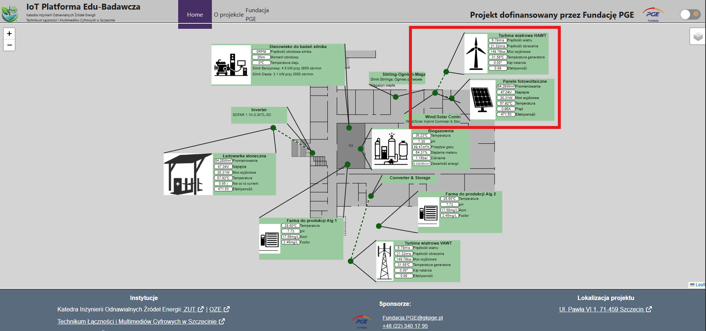
*Zrzut ekranu z interfejsu użytkownika pokazujący lokalizację turbiny wiatrowej HAWT na interaktywnej mapie*

**Turbina wiatrowa HAWT**
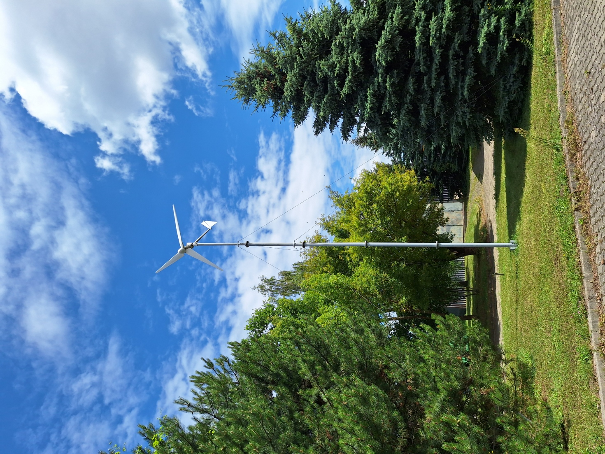

**Panele fotowoltaiczne**


**Kontroler hybrydowy Wind/Solar**


**Inverter instalacji hybrydowej**
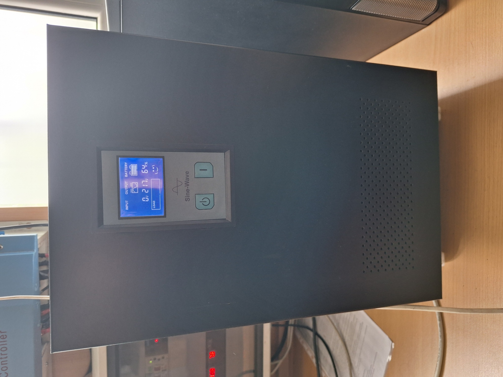

#### 2.2.2 System ładowania słonecznego na hulajnogach

**Lokalizacja na mapie systemu:**
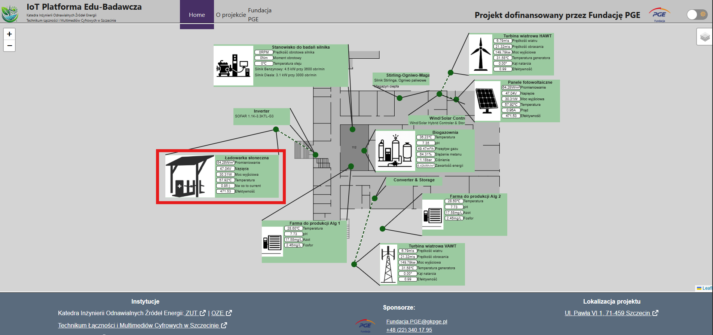
*Zrzut ekranu z interfejsu użytkownika pokazujący lokalizację instalacji PV na hulajnogach na interaktywnej mapie*

**Ładowarka słoneczna**


**Inverter SOFAR 1.1K-3.3KTL-G3**


#### 2.2.4 Turbina wiatrowa

**Lokalizacja na mapie systemu:**
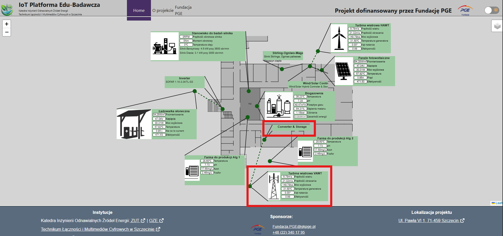
*Zrzut ekranu z interfejsu użytkownika pokazujący lokalizację turbiny wiatrowej VAWT na interaktywnej mapie*

**Turbina VAWT (Vertical Axis Wind Turbine)**


#### 2.2.5 Biogazownia

**Lokalizacja na mapie systemu:**
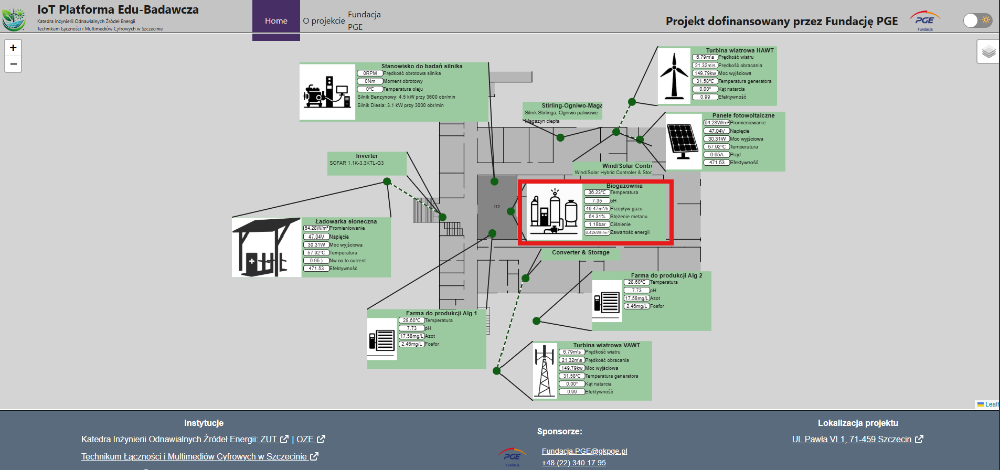
*Zrzut ekranu z interfejsu użytkownika pokazujący lokalizację biogazowni na interaktywnej mapie*

**Zdjęcie urządzenia:**
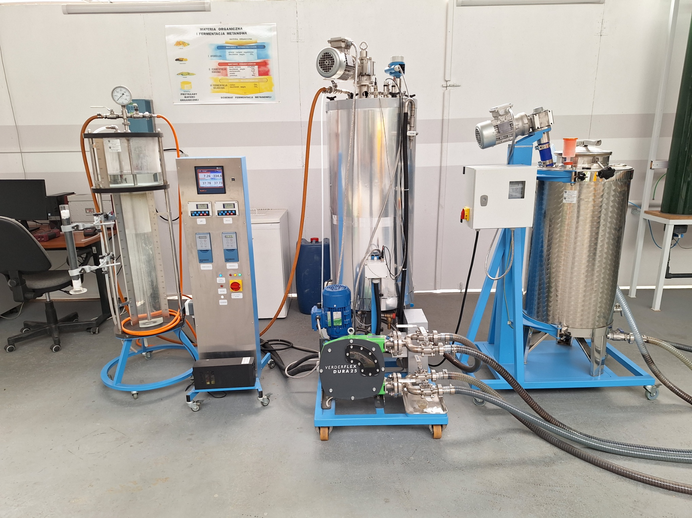

#### 2.2.6 Silnik Stirlinga i ogniwo paliwowe

**Lokalizacja na mapie systemu:**
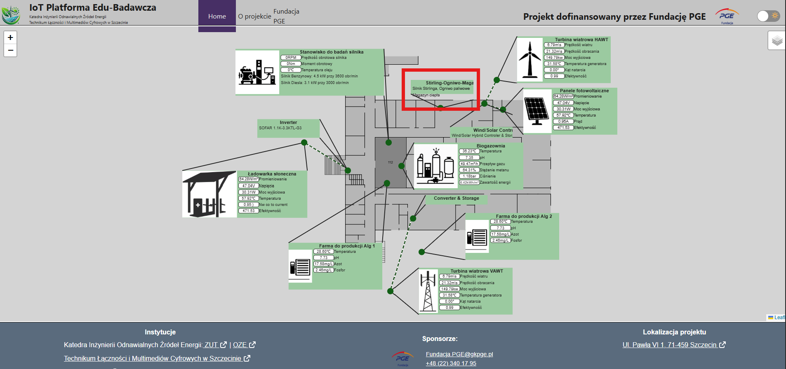
*Zrzut ekranu z interfejsu użytkownika pokazujący lokalizację silnika Stirlinga i ogniwa paliwowego na interaktywnej mapie*

**Zdjęcie urządzenia:**
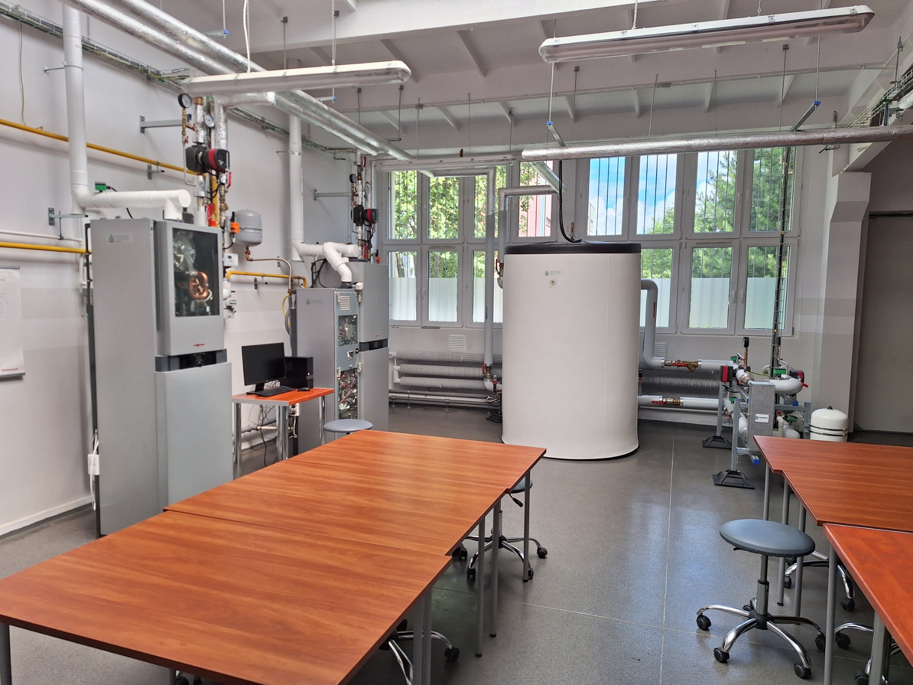


#### 2.2.8 Farmy alg

**Lokalizacja na mapie systemu:**
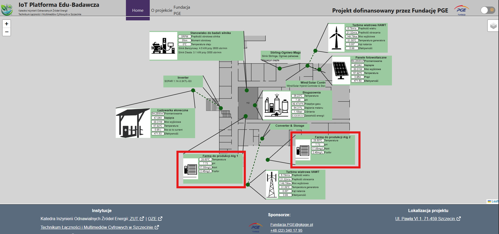
*Zrzut ekranu z interfejsu użytkownika pokazujący lokalizację farmy alg 1 na interaktywnej mapie*

**Farma alg w środu budynka**
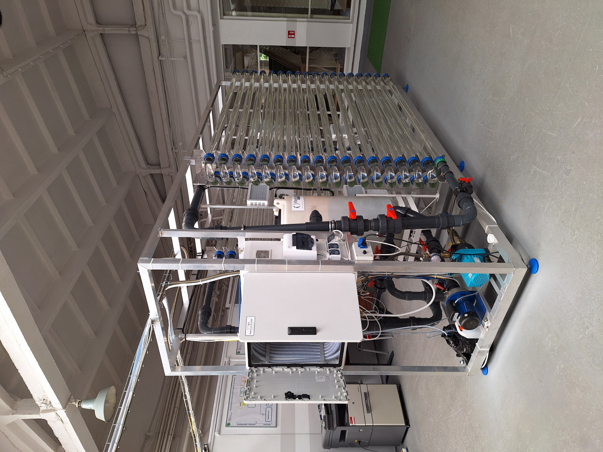


**Farma alg wolnostająca na zewnącz**


#### 2.2.9 Stanowisko do badań silnika

**Lokalizacja na mapie systemu:**
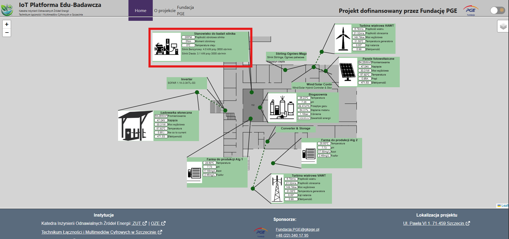
*Zrzut ekranu z interfejsu użytkownika pokazujący lokalizację stanowiska do badań silnika na interaktywnej mapie*

**Zdjęcie urządzenia:**


---

## 3. Funkcjonalności systemu

### 3.1 Monitorowanie w czasie rzeczywistym
- Aktualizacja danych co 5-30 sekund
- Wizualizacja na interaktywnej mapie

### 3.2 Analiza historyczna
- Przechowywanie danych przez 30 dni
- Wykresy trendów (godzina, dzień, tydzień, miesiąc)


## 4. Technologie i narzędzia

### 4.1 Stack technologiczny

**Backend i infrastruktura:**
- **Docker & Docker Compose** - Konteneryzacja i orkiestracja
- **MQTT (Eclipse Mosquitto)** - Protokół komunikacji IoT
- **Node-RED** - Wizualne programowanie przepływów danych
- **InfluxDB 2.7** - Baza danych szeregów czasowych
- **Express.js** - Backend API
- **Nginx** - Reverse proxy i load balancing

**Frontend:**
- **React 19** - Framework JavaScript
- **TypeScript** - Typowanie statyczne
- **Leaflet** - Interaktywne mapy
- **Vite** - Build tool i dev server
- **SCSS** - Preprocesor CSS

**Wizualizacja:**
- **Grafana 10.2** - Platforma analityczna i wizualizacyjna
- **React Charts** - Komponenty wykresów w aplikacji webowej

**Kluczowe komponenty systemu:**

1. **MQTT Broker (Eclipse Mosquitto)**
   - Centralny punkt komunikacji dla wszystkich urządzeń IoT
   - Obsługa QoS dla niezawodnej transmisji danych
   - Autentykacja i autoryzacja użytkowników
   - WebSocket support dla aplikacji webowych

2. **Node-RED (Przetwarzanie danych)**
   - Wizualne programowanie przepływów danych
   - Walidacja i transformacja danych
   - Integracja z bazą danych InfluxDB

3. **InfluxDB 2.7 (Baza danych czasowych)**
   - Optymalizacja dla danych szeregów czasowych
   - Automatyczna retencja danych (30 dni)
   - Zaawansowane zapytania w języku Flux
   - Skalowalna architektura

4. **Grafana (Wizualizacja danych)**
   - Specjalistyczne dashboardy
   - Wizualizacja w czasie rzeczywistym

5. **Aplikacja React (Interfejs użytkownika)**
   - Adress strony: edubad.zut.edu.pl
   - Interaktywna mapa z lokalizacją urządzeń
   - Wizualizacja danych w czasie rzeczywistym
   - Responsywny design (desktop i mobile)
   - Integracja z backend API

6. **Express.js Backend (API REST)**
   - RESTful API do dostępu do danych
   - Agregacja i przetwarzanie danych
   - Integracja z InfluxDB

---

## 5. Wdrożenie i dostępność

### 5.1 Środowisko produkcyjne

System został wdrożony na serwerze produkcyjnym:
- **Serwer:** edubad.zut.edu.pl (82.145.64.204)
- **Dostęp:** Przez przeglądarkę internetową
- **Uptime:** System działa 24/7
- **Backup:** Automatyczne kopie zapasowe danych


## 6. Korzyści edukacyjne i badawcze

### 6.1 Dla studentów
- **Praktyczna nauka** - Bezpośredni kontakt z systemami IoT
- **Analiza danych** - Praca z rzeczywistymi danymi z urządzeń OZE
- **Programowanie** - Możliwość modyfikacji przepływów Node-RED
- **Wizualizacja** - Tworzenie własnych dashboardów w Grafana
- **Projekty dyplomowe** - Platforma do realizacji prac inżynierskich i magisterskich

### 6.2 Dla naukowców
- **Zbieranie danych** - Długoterminowe zbieranie danych do analiz
- **Testowanie hipotez** - Weryfikacja teorii na rzeczywistych danych
- **Publikacje** - Materiał do publikacji naukowych
- **Współpraca** - Platforma do współpracy między instytucjami

### 6.3 Dla praktyków
- **Szkolenia** - Platforma do szkoleń z zakresu OZE
- **Demonstracje** - Prezentacja możliwości systemów monitorowania
- **Optymalizacja** - Analiza efektywności różnych konfiguracji

---

## 7. Instytucje zaangażowane

### 7.1 Realizatorzy projektu
- **Katedra Inżynierii Odnawialnych Źródeł Energii** (Zachodniopomorski Uniwersytet Technologiczny w Szczecinie)
  - Strona: https://oze.zut.edu.pl/
  - Rola: Główny realizator projektu, opieka merytoryczna

- **Technikum Łączności i Multimediów Cyfrowych w Szczecinie**
  - Strona: https://tlimc.szczecin.pl
  - Rola: Współpraca edukacyjna, testowanie systemu

### 7.2 Lokalizacja projektu
**Adres:** Ul. Pawła VI 1, 71-459 Szczecin

### 7.3 Sponsor
**Fundacja PGE**
- Strona: https://fundacjapge.pl/
- Email: Fundacja.PGE@gkpge.pl
- Telefon: +48 (22) 340 17 95

---

## 8. Osiągnięcia projektu

### 8.1 Zrealizowane funkcjonalności
✅ **Kompletna infrastruktura IoT**
- Broker MQTT z pełną konfiguracją
- System przetwarzania danych w Node-RED
- Baza danych czasowych InfluxDB
- System wizualizacji Grafana

✅ **Monitorowanie 10+ typów urządzeń**
- Panele fotowoltaiczne (4 lokalizacje)
- Turbiny wiatrowe (HAWT i VAWT)
- Biogazownia
- Farmy alg (2 lokalizacje)
- Magazyny energii
- Silnik Stirlinga i ogniwo paliwowe
- Stanowisko testowe silników
- Ładowarki słoneczne

✅ **Aplikacja webowa**
- Interaktywna mapa z lokalizacją urządzeń
- Wizualizacja danych w czasie rzeczywistym
- Responsywny design
- Integracja z backend API

✅ **7 dashboardów Grafana**
- Przegląd systemu
- Dashboardy dla każdego typu urządzenia
- System alertów

✅ **Dokumentacja**
- Kompletna dokumentacja techniczna
- Przewodniki użytkownika
- Instrukcje instalacji i konfiguracji

✅ **Wdrożenie produkcyjne**
- System działa na serwerze produkcyjnym
- Dostęp 24/7
- Automatyczne kopie zapasowe

### 8.2 Statystyki projektu
- **Liczba monitorowanych urządzeń:** 10+ typów
- **Liczba dashboardów:** 7 specjalistycznych dashboardów
- **Częstotliwość aktualizacji danych:** 5-30 sekund
- **Retencja danych:** 30 dni
- **Dostępność systemu:** 24/7
- **Liczba linii kodu:** ~15,000+ (frontend + backend + flows)

---

## 9. Perspektywy rozwoju

### 9.1 Planowane rozszerzenia
- **Integracja FUXA SCADA** - Przemysłowy interfejs HMI
- **Aplikacja mobilna** - Dostęp z urządzeń mobilnych
- **Machine Learning** - Predykcyjna analiza danych
- **Rozszerzenie o nowe urządzenia** - Więcej typów OZE
- **SSL/HTTPS** - Bezpieczna komunikacja
- **Zaawansowane alerty** - Inteligentny system powiadomień

### 9.2 Możliwości współpracy
- Integracja z innymi systemami monitorowania
- Współpraca z innymi uczelniami
- Projekty badawcze z wykorzystaniem platformy
- Szkolenia i warsztaty

---

## 10. Podsumowanie

Projekt **"IoT Platforma Edu-Badawcza do monitorowania odnawialnych źródeł energii"** został pomyślnie zrealizowany, tworząc nowoczesną, kompleksową platformę do monitorowania i analizy danych z urządzeń OZE. System łączy w sobie najnowsze technologie IoT, przetwarzania danych i wizualizacji, oferując unikalne narzędzie edukacyjne i badawcze.

Dzięki dofinansowaniu Fundacji PGE, platforma jest dostępna dla studentów, naukowców i praktyków, umożliwiając:
- Praktyczną naukę technologii IoT w kontekście energetyki odnawialnej
- Prowadzenie badań naukowych na rzeczywistych danych
- Szkolenia i demonstracje możliwości systemów monitorowania OZE

Platforma jest w pełni funkcjonalna i gotowa do dalszego rozwoju oraz wykorzystania w celach edukacyjnych i badawczych.


---

**Data przygotowania sprawozdania:** 2025

**Przygotował:** Zespół projektu IoT Platforma Edu-Badawcza  
**Katedra Inżynierii Odnawialnych Źródeł Energii**  
**Zachodniopomorski Uniwersytet Technologiczny w Szczecinie**

---

*Dokument został przygotowany w formacie Markdown i może być łatwo konwertowany do formatu PDF lub innych formatów dokumentów.*

